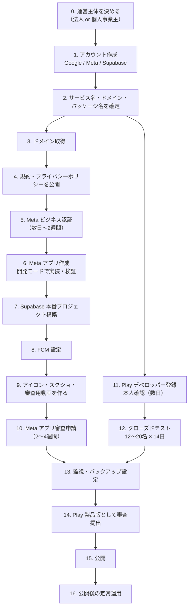

# 手動設定ガイド

コードでは自動化できず、**人がブラウザの管理画面で操作する必要がある作業**をまとめたもの。
クラウドやアプリ申請を初めて触る人向けに、クリックする場所まで書いている。

> **このガイドの前提**
> PoC 用の Web 版は Firebase Hosting へデプロイ済み（[../poc_guide.md](../poc_guide.md) 参照）。
> ただし**ストア公開・Meta 本審査などの「本番リリース」はまだ**であり、
> そのために必要な「契約・申請・設定」がこのフォルダにある。
> 開発環境の構築手順は [../setup_checklist.md](../setup_checklist.md) を参照。
>
> **注**: 一覧のうち「(未執筆)」と付いたドキュメントはまだ存在しない。
> リンクを開いても 404 になるので、着手時に執筆してから作業を進めること。

---

## 0. 最初に読む「3行のまとめ」

1. **Meta（Instagram）のアプリ審査が最大の関門**。2〜4 週間かかり、これが通らないとアプリは成立しない。**今日から動く。**
2. **Google Play の個人アカウントはテスターを 12〜20 名集めて 14 日間**待つ必要がある。これも早く動く。
3. **サービス名・ドメイン・パッケージ名は後から変えられない。**最初に確定させる。

---

## 1. ドキュメントの一覧

| # | ドキュメント | 扱う内容 | 着手の優先度 |
| --- | --- | --- | --- |
| 0 | [accounts.md](accounts.md) | 各種アカウント・パスワード管理・支払い・運営主体 | **最初** |
| 1 | [naming.md](naming.md) | サービス名・ドメイン・パッケージ名の確定（**後から変更不可**） | **最初** |
| 2 | [meta_instagram.md](meta_instagram.md) | Meta 開発者登録・Instagram 連携・**アプリ審査** | **最優先** |
| 3 | [supabase.md](supabase.md) | Supabase プロジェクトの作成と本番設定 | 高 |
| 4 | domain.md（未執筆） | ドメイン取得と、規約ページの公開 | 高 |
| 5 | legal.md（未執筆） | 利用規約・プライバシーポリシー・ステマ規制対応 | 高 |
| 6 | [gcp_firebase.md](gcp_firebase.md) | Firebase（お試し Web の Hosting・GA4 計測・FCM）の設定 | 高 |
| 7 | assets.md（未執筆） | アイコン・ストア画像・**審査用の操作動画** | 中 |
| 8 | google_play.md（未執筆） | Google Play への申請 | 高 |
| 9 | admob.md（未執筆） | 広告（AdMob）の設定 | 低 |
| 10 | monitoring_backup.md（未執筆） | 監視・アラート・バックアップ | 中 |
| 11 | release_checklist.md（未執筆） | 公開当日の手順と、公開後の運用 | 公開直前 |
| 12 | [github_automation.md](github_automation.md) | GitHub 自動化（Issue から Claude・プレビュー・本番反映・APK 配布）の Secrets 設定 | 高（PoC を回す前） |

---

## 2. 全体の流れ

**待ち時間が長いものから先に着手する**のがコツ。
特に「Meta のビジネス認証」「Meta のアプリ審査」「Play の本人確認」「Play のクローズドテスト 14 日」は、
**他の作業と並行して進められる**ので、真っ先に走らせる。

---

## 3. チェックリスト

進捗はここにチェックを入れて管理する。

### フェーズ 0: 運営主体とアカウント

- [ ] 運営主体（法人 / 個人事業主 / 個人）を決めた（`OI-05`）
- [ ] 個人事業主の場合、開業届の控えを用意した
- [ ] 運用専用の Google アカウントを作成した
- [ ] 2 段階認証を有効にし、バックアップコードを保管した
- [ ] Facebook（Meta）の個人アカウントを用意した（実名・本人確認可能なもの）
- [ ] GitHub アカウントを用意した
- [ ] Supabase アカウントを作成した
- [ ] パスワードマネージャを用意した
- [ ] 支払い用のクレジットカードを登録した
- [ ] 問い合わせを受信できるメールアドレスを用意した

→ 詳細: [accounts.md](accounts.md)

### フェーズ 1: 名前の確定（後戻り不可）

- [ ] サービス名を決めた（`OI-44`）
- [ ] 商標・既存サービスとの重複を確認した
- [ ] ドメイン名を決めた
- [ ] Android のパッケージ名（`applicationId`）を決めた
- [ ] 決めた名前が `app/`（pubspec の `name` / `applicationId`）に反映されていることを確認した

→ 詳細: [naming.md](naming.md)

### フェーズ 2: ドメインと法務

- [ ] ドメインを取得した
- [ ] 静的サイトのホスティングを用意した
- [ ] プライバシーポリシーを公開 URL で用意した
- [ ] 利用規約を公開 URL で用意した
- [ ] **データ削除リクエスト用のページ**を公開 URL で用意した（Meta / Play の必須要件）
- [ ] 問い合わせ用メールアドレスが受信できることを確認した

→ 詳細: domain.md / legal.md（いずれも未執筆）

### フェーズ 3: Meta（Instagram 連携）

- [ ] Meta ビジネスポートフォリオを作成した
- [ ] Facebook ページを作成した
- [ ] **ビジネス認証（Business Verification）を申請し、通過した**
- [ ] Meta for Developers に開発者登録した
- [ ] アプリを作成した（タイプ: ビジネス）
- [ ] Instagram 関連の製品を追加した
- [ ] OAuth リダイレクト URI を登録した
- [ ] データ削除コールバック URL を登録した
- [ ] 開発モードでテストユーザーを追加し、実際にインサイトが取れることを確認した（`OI-37`）
- [ ] アプリシークレットを Supabase のシークレットに登録した
- [ ] 審査用の操作動画・テストアカウントを用意した
- [ ] **アプリ審査を申請し、必要な権限がすべて承認された**
- [ ] アプリを「ライブ」モードに切り替えた

→ 詳細: [meta_instagram.md](meta_instagram.md)

### フェーズ 4: Supabase（本番環境）

- [ ] 組織と本番プロジェクトを作成した（リージョン: Tokyo）
- [ ] データベースのパスワードを保管した
- [ ] **Exposed schemas に `private` が含まれていないことを確認した**（最重要）
- [ ] 料金プランを決めた（Free / Pro）
- [ ] マイグレーションを適用した
- [ ] 必要な拡張機能を有効にした（`pg_cron` / `pg_net` / Vault）
- [ ] Vault に `project_url` と `service_role_key` を登録した
- [ ] Edge Functions をデプロイした
- [ ] Edge Functions のシークレットを登録した
- [ ] Auth の設定（メール確認・リダイレクト URL・SMTP）を行った
- [ ] メールテンプレート 3 種を `supabase/templates/` の内容で差し替えた
- [ ] Storage のバケットとポリシーを作成した
- [ ] `supabase/tests/` が本番マイグレーションでも通ることを確認した
- [ ] バックアップ（PITR）を有効にした
- [ ] MFA を有効にした

→ 詳細: [supabase.md](supabase.md)

### フェーズ 5: 通知・素材

- [ ] Firebase プロジェクトを作成した
- [ ] Android アプリを登録し `google-services.json` を配置した（**コミットしない**）
- [ ] FCM v1 用のサービスアカウント鍵を Supabase のシークレットに登録した
- [ ] アプリアイコン（512×512 PNG）を作成した
- [ ] アプリ内アイコン（各解像度）を生成し組み込んだ
- [ ] フィーチャーグラフィック（1024×500）を作成した
- [ ] スクリーンショット（スマホ用 2〜8 枚）を撮影した
- [ ] **Meta 審査用の操作動画**を撮影した

→ 詳細: [gcp_firebase.md](gcp_firebase.md) / assets.md（未執筆）

### フェーズ 6: Google Play

- [ ] デベロッパーアカウントを登録した（$25、本人確認あり）
- [ ] アプリを作成した
- [ ] アップロード鍵（keystore）を作成し、2 か所にバックアップした
- [ ] ストアの掲載情報を入力した
- [ ] データセーフティを入力した
- [ ] コンテンツレーティングを取得した
- [ ] **UGC（ユーザー生成コンテンツ）ポリシーへの対応**を確認した
- [ ] **アカウント削除の要件**に対応した
- [ ] 署名済み AAB をアップロードした
- [ ] 内部テストで動作を確認した
- [ ] クローズドテスト（12〜20 名 × 14 日）を完了した
- [ ] 製品版として審査に提出した

→ 詳細: google_play.md（未執筆）

### フェーズ 7: 広告・監視

- [ ] AdMob アカウントを作成した（`OI-07`）
- [ ] 広告ユニットを作成し、アプリに実装した
- [ ] `app-ads.txt` を公開した
- [ ] 日次バッチの失敗アラートを設定した
- [ ] Supabase の使用量アラートを設定した
- [ ] バックアップの復元手順を一度試した

→ 詳細: admob.md / monitoring_backup.md（いずれも未執筆）

### フェーズ 8: 公開と運用

- [ ] 本番環境でエンドツーエンドの疎通確認をした
- [ ] 製品版を公開した
- [ ] 公開直後の動作とログを確認した
- [ ] 年次の更新作業をカレンダーに登録した

→ 詳細: release_checklist.md（未執筆）

---

## 4. 所要期間の目安

【仮定】以下は目安であり、審査の混雑状況により大きく変動する。

| フェーズ | 実作業 | 待ち時間 |
| --- | --- | --- |
| 運営主体とアカウント | 半日 | 開業届を出す場合は数日 |
| 名前の確定 | 半日〜数日 | — |
| ドメイン | 1 時間 | DNS 反映と SSL 発行に最大 24〜48 時間 |
| 法務（規約作成） | 1〜3 日（＋専門家レビュー） | レビューに 1〜2 週間 |
| **Meta ビジネス認証** | 2 時間 | **数日〜2 週間** |
| **Meta アプリ審査** | 1〜2 日（動画作成含む） | **2〜4 週間**（差し戻しがあると再度） |
| Supabase 本番構築 | 1 日 | — |
| FCM | 2 時間 | — |
| アイコン・素材 | 1〜3 日 | — |
| **Play 本人確認** | 1 時間 | **数日〜2 週間** |
| **Play クローズドテスト** | テスター募集に数日 | **14 日間（固定）** |
| Play 審査 | 半日 | **数日〜2 週間** |
| 広告（AdMob 審査） | 2 時間 | 数日〜2 週間 |
| 監視・バックアップ | 2 時間 | — |

**最短でも、動くコードができてから公開まで 1.5〜2 か月**は見ておく。

---

## 5. 費用の目安

【仮定】2026 年時点の一般的な公開価格をもとにした概算。**契約前に必ず最新価格を確認する**（`OI-39`）。

| 項目 | 費用 | 頻度 |
| --- | --- | --- |
| ドメイン（`.app` / `.jp` など） | 年 2,000〜4,000 円 | 毎年 |
| Google Play デベロッパー登録 | $25（約 4,000 円） | 初回のみ |
| Supabase Free プラン | 0 円 | — |
| Supabase Pro プラン | 約 $25/月（約 4,000 円） | 毎月 |
| Supabase PITR（追加バックアップ） | 約 $100/月〜 | 毎月（必要なら） |
| Firebase（FCM のみ） | 0 円 | — |
| 静的サイトのホスティング | 0 円（GitHub Pages / Cloudflare Pages） | — |
| 独自ドメインのメール | 0 円〜月 800 円 | 毎月 |
| パスワードマネージャ | 0 円〜月 400 円 | 毎月 |
| 弁護士による規約レビュー | 5〜30 万円 | 初回（＋改定時） |
| Apple Developer Program（iOS 対応時） | 年 $99 | 毎年 |
| Meta 開発者登録・アプリ審査 | 0 円 | — |

> **Supabase Free プランは、一定期間アクセスがないとプロジェクトが一時停止される。**
> 本番運用では Pro プランを前提にする（`OI-39`）。

---

## 6. 事故を防ぐための注意

| 注意 | 理由 |
| --- | --- |
| **`private` スキーマを Supabase の「Exposed schemas」に追加しない** | 追加した瞬間にインサイト実数値と SNS トークンが全世界に公開される。**このアプリで最悪の事故** |
| **`service_role` キーをアプリに埋め込まない** | このキーは RLS をすべて無視する。漏れたら全データが読み書きされる |
| **Meta のアプリ審査は「動くもの」がないと通らない** | 審査担当者が実際に操作する。開発モードで完成させてから申請する |
| **Android のパッケージ名は公開後に変更できない** | 変更したい場合は別アプリとして出し直しになる |
| **アップロード鍵（keystore）とそのパスワードを紛失しない** | 紛失するとアプリを更新できなくなる |
| **`google-services.json` や `.env` をコミットしない** | 資格情報の漏洩 |
| **本番と開発で Supabase プロジェクトを分ける** | 検証で本番データを壊さない |
| **Supabase のバックアップは自動では十分でない** | Free プランにバックアップはない。誤削除しても戻せない |
| **チャット・応募メッセージはユーザー生成コンテンツ** | Play の UGC ポリシー対応（通報・ブロック・規約）がないと審査で落ちる |
| **アカウント削除の導線がないと Play の審査に落ちる** | アプリ内とウェブの両方に削除手段が必要 |
| **ドメインの有効期限を切らさない** | 規約 URL と OAuth リダイレクトが同時に死ぬ |

---

## 7. このガイドと未決事項（OI）の関係

このガイドの中で「人が決めないと進まないこと」は、
[../open_issues.md](../open_issues.md) の `OI-xx` と対応している。

| OI | 内容 | 関連ドキュメント |
| --- | --- | --- |
| `OI-01` | Meta アプリ審査の申請主体と事業者確認 | [meta_instagram.md](meta_instagram.md) |
| `OI-03` | 利用規約・プライバシーポリシーの作成主体 | legal.md（未執筆） |
| `OI-04` | ステマ規制の強制方法 | legal.md（未執筆） |
| `OI-05` | サービス運営主体（法人格・所在地） | [accounts.md](accounts.md) |
| `OI-07` | 広告の実装方式と表示位置 | admob.md（未執筆） |
| `OI-08` | 投稿者の年齢制限 | legal.md（未執筆） / google_play.md（未執筆） |
| `OI-11` | プッシュ通知基盤 | [gcp_firebase.md](gcp_firebase.md) |
| ~~`OI-17`~~ | ~~SNS トークンの暗号化方式~~ → **決定済み**（AES-256-GCM + Supabase Secrets、[ADR-0006](../adr/0006-token-encryption.md)） | [supabase.md](supabase.md) |
| `OI-37` | Instagram の取得可能指標の最終確認 | [meta_instagram.md](meta_instagram.md) |
| `OI-39` | 各サービスの最新価格の確認 | このファイルの 5 章 |
| `OI-44` | サービス名・ドメイン・パッケージ名の確定 | [naming.md](naming.md) |
