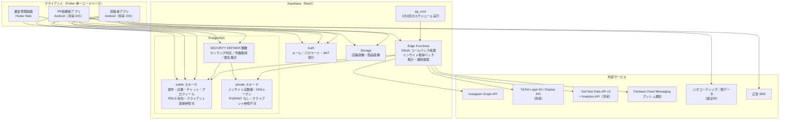
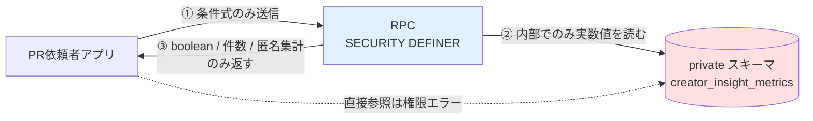
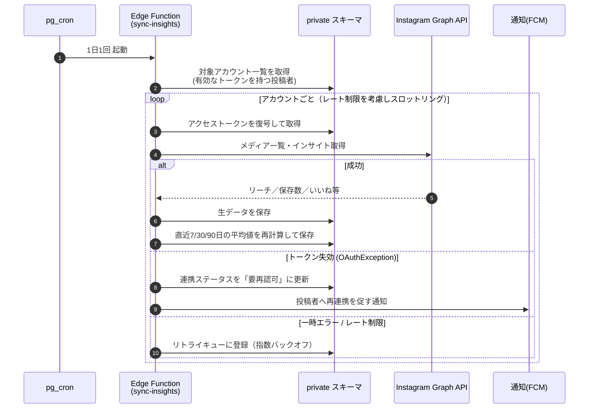
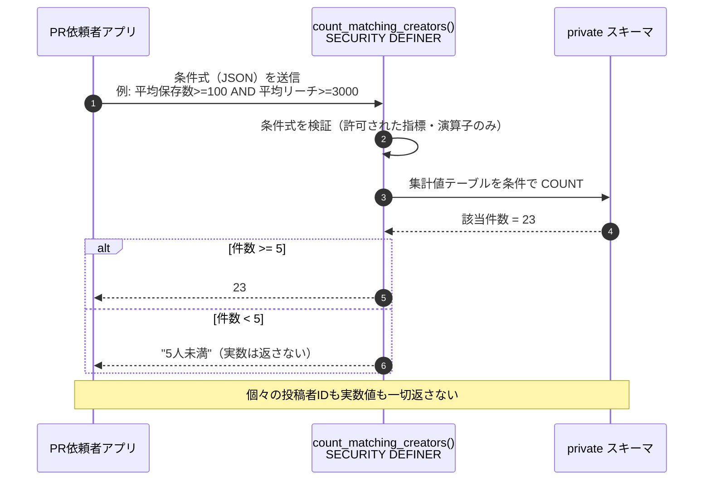
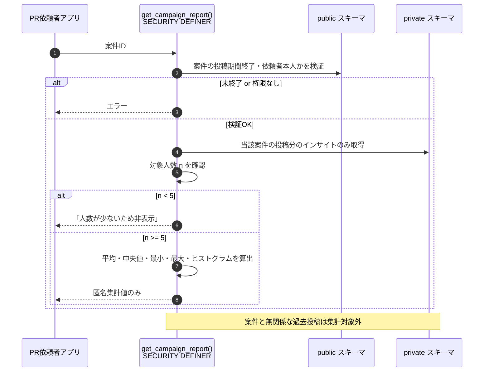

# 2. システム全体像

---

## 2-1. アーキテクチャ方針

【前提】本システムは以下の方針で設計する。

| # | 方針 | 理由 |
|---|---|---|
| A-1 | **サーバーレス構成**を採用し、常時稼働サーバーを持たない | 初期規模（数十〜数百ユーザー）でのランニングコストと運用保守工数を最小化するため（依頼者の最優先事項） |
| A-2 | **BaaS（Supabase）**を中核に据え、自前バックエンドの実装量を最小化 | 同上。認証・DB・ストレージ・スケジューラを一体で得られる |
| A-3 | **インサイト実数値はクライアントに到達させない**ことを DB 権限レベルで強制 | アプリ実装のバグや将来の改修でも漏れないようにするため（2-3 参照） |
| A-4 | **クロスプラットフォーム（Flutter）**で単一コードベース | 将来の iOS 展開の追加コストを最小化 |
| A-5 | SNS API へのアクセスは**サーバー側のみ**。クライアントにアクセストークンを保持しない | トークン漏洩リスクの排除 |

> 技術選定の比較検討結果は 11章、決定の経緯は `docs/adr/` に記載する。

---

## 2-2. 全体構成図

---

## 2-3. コンポーネント一覧

| # | コンポーネント | 役割 | 実装 |
|---|---|---|---|
| C-1 | 投稿者アプリ | 案件検索・応募・チャット・SNS連携 | Flutter |
| C-2 | PR依頼者アプリ | 案件作成・条件設定・選考・チャット・成果レポート閲覧 | Flutter |
| C-3 | 運営管理画面 | ユーザー／案件／通報の管理、停止措置 | Flutter Web（`OI-15`） |
| C-4 | Auth | 認証・JWT 発行・ロール保持 | Supabase Auth |
| C-5 | `public` スキーマ | クライアントが直接参照してよいデータ。全テーブルで RLS 有効 | PostgreSQL |
| C-6 | `private` スキーマ | **インサイト実数値・SNSアクセストークン**。クライアントロールに GRANT しない | PostgreSQL |
| C-7 | RPC 関数群 | `SECURITY DEFINER` で `private` を読み、**boolean / 件数 / 匿名集計値のみ**返す | PL/pgSQL |
| C-8 | Storage | 店舗画像・商品画像 | Supabase Storage |
| C-9 | Edge Functions | SNS OAuth コールバック、インサイト取得バッチ、緩和提案生成、通知送信 | Deno / TypeScript |
| C-10 | スケジューラ | 1日1回バッチのトリガ | `pg_cron`（決定事項） |
| C-11 | プッシュ通知 | 応募・マッチング・緩和提案等の通知 | FCM（`OI-11`） |

---

## 2-4. インサイト非開示アーキテクチャ原則（最重要）

【事実】要件「PR依頼者は投稿者の個々のインサイト実数値を一切閲覧できない」を、**アプリ実装の善意に依存せず**担保する。以下の 3 層防御を全実装の絶対制約とする。

### 第1層：スキーマ分離（DB 権限）

| ルール | 内容 |
|---|---|
| L1-1 | インサイト実数値は `private` スキーマにのみ格納する。`public` に写像・複製・ビュー作成をしてはならない。 |
| L1-2 | `private` スキーマは `anon` / `authenticated` ロールに `USAGE` を **GRANT しない**。PostgREST の公開スキーマ設定にも含めない。 |
| L1-3 | したがって、クライアントが Supabase SDK から `private.*` を直接クエリしても **必ず権限エラー**になる。 |

### 第2層：RPC による情報の絞り込み

| ルール | 内容 |
|---|---|
| L2-1 | `private` を読めるのは `SECURITY DEFINER` を付与した RPC 関数と Edge Functions（service_role）のみ。 |
| L2-2 | RPC の**戻り値の型**として、インサイト実数値を含む型を定義してはならない。返してよいのは以下のみ。 ・boolean（条件合致するか） ・integer（該当人数などの件数） ・匿名集計値（平均・中央値・最小・最大・ヒストグラムのビン別件数） |
| L2-3 | 関数内部では `SET search_path` を明示し、検索パス経由の意図しない参照を防ぐ。 |

### 第3層：出力の丸め・k-匿名性

| ルール | 内容 |
|---|---|
| L3-1 | 成果レポートの集計は、対象人数が **k = 5 未満**の場合は数値を返さず「人数が少ないため非表示」を返す（決定事項）。 |
| L3-2 | 条件設定中の「該当投稿者数」も、5 人未満の場合は実数を返さず「5人未満」として返す。**実数を返すと、条件を 1 つずつ動かして特定個人の値を二分探索できてしまう**ため。 |
| L3-3 | 成果レポートの最小値・最大値は、そのまま返すと外れ値の個人が特定されうる。ヒストグラムのビン単位に丸めるか、件数が k 未満のビンは隣接ビンへ統合する。 |
| L3-4 | チャット・応募一覧で PR依頼者に見せる投稿者の表示名は、**案件内で閉じた連番**（投稿者A、投稿者B…）とする（決定事項）。案件をまたいだ名寄せを不可能にするため、連番は案件ごとに独立して採番する。 |

> 【推奨】上記 L1〜L3 の各ルールは、実装時に自動テスト（`authenticated` ロールで `private.*` を SELECT すると失敗すること等）で常時検証する。テスト方針は 10章に記載する。

---

## 2-5. 主要データフロー

### 2-5-1. 日次インサイト取得バッチ

【事実】インサイトはリアルタイム取得せず、1日1回の定期バッチで更新する。

### 2-5-2. 条件設定中の該当投稿者数リアルタイム表示

【事実】PR依頼者が条件を設定している最中に、該当する投稿者数を表示する。**この時点でもインサイト実数値は一切クライアントに渡らない。**

### 2-5-3. 投稿後の成果レポート

---

## 2-6. 環境構成

【推奨】コスト最小化のため、以下の 2 環境構成を提案する。

| 環境 | 用途 | 構成 |
|---|---|---|
| ローカル開発 | 日常開発・自動テスト | Supabase CLI によるローカルスタック（Docker）。SNS API はモック |
| 本番 | 実利用 | Supabase クラウド（無料枠 → 必要に応じて Pro） |

【推奨】専用のステージング環境は**初期は持たない**。理由は月額コストの増加（Supabase の有料プランはプロジェクト単位課金）。本番リリース前の検証はローカルスタック＋Meta の開発モードで行う。ユーザー数が増えた段階で追加を検討する（`OI-16`）。

---

## 本章の未決事項

| ID | タイトル |
|---|---|
| `OI-11` | プッシュ通知基盤の選定 |
| `OI-15` | 運営管理画面の実装形態 |
| `OI-16` | ステージング環境の要否とコスト |
| `OI-17` | SNS アクセストークンの暗号化方式と鍵管理 |

詳細は [open_issues.md](../open_issues.md) を参照。
