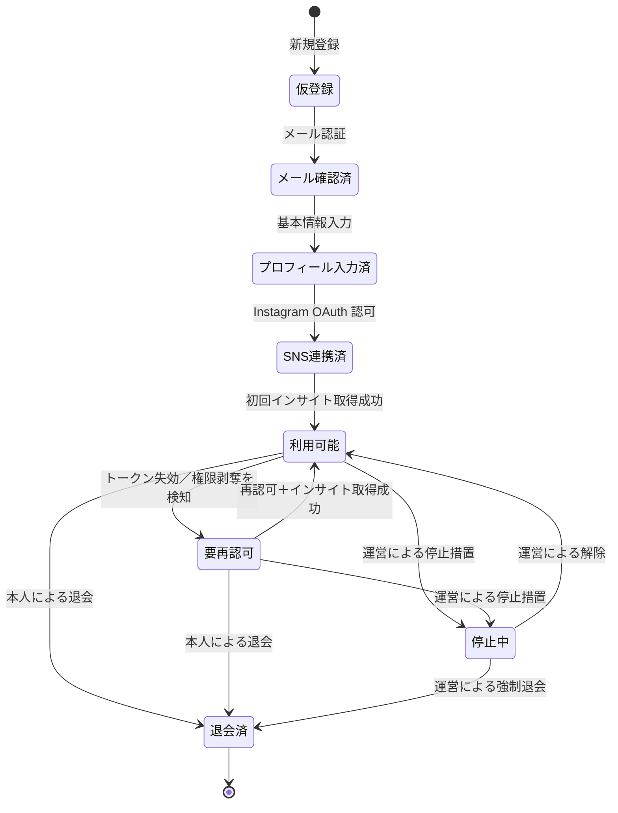
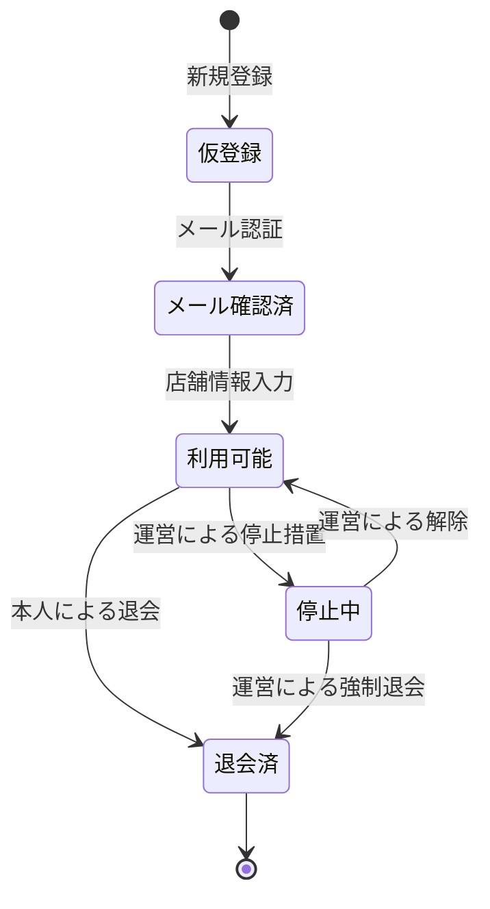

# 3. ユーザー種別と権限

---

## 3-1. ロール定義

【事実】本アプリには以下の 3 ロールが存在する。

| ロールID | 名称 | 説明 | 登録方法 |
|---|---|---|---|
| `creator` | 投稿者 | インフルエンサー。SNS アカウントを連携し、案件に応募する。 | 誰でも登録可能。ただし **SNS連携（Instagram）が完了するまで応募できない**。 |
| `client` | PR依頼者 | 店舗・企業。案件を投稿する。 | **誰でも登録可能**（運営承認制ではない）。ただし通報・規約違反時に運営が停止できる。 |
| `admin` | 運営（管理者） | サービス運営者。ユーザー・案件・通報・審査を管理する。 | **アプリからは登録できない**。運営が管理画面から招待して作成する。 |

【推奨】上記に加え、システム内部ロールとして以下を定義する。

| ロールID | 名称 | 説明 |
|---|---|---|
| `guest` | 未認証 | ログイン前。案件一覧の閲覧すら不可（`OI-22` で要確認）。 |
| `service_role` | システム | Edge Functions / バッチが使用する特権ロール。人間には払い出さない。 |

【推奨】1 つのアカウントが `creator` と `client` を兼ねることは**初期リリースでは不可**とする。理由は権限判定と匿名性担保の複雑化を避けるため。同一人物が両方を使いたい場合は別アカウントで登録する。

---

## 3-2. 機能別 権限マトリクス

【事実】◯＝可、△＝条件付きで可、×＝不可

| 機能 | guest | creator | client | admin |
|---|:---:|:---:|:---:|:---:|
| **アカウント** | | | | |
| 新規登録（投稿者／PR依頼者） | ◯ | × | × | × |
| 自分のプロフィール編集 | × | ◯ | ◯ | ◯ |
| 退会 | × | ◯ | ◯ | × |
| 他ユーザーの停止・解除 | × | × | × | ◯ |
| 管理者アカウントの発行 | × | × | × | △ 上位管理者のみ |
| **SNS連携** | | | | |
| 自分の SNS アカウントを連携／解除 | × | ◯ | × | × |
| 他人の SNS 連携状態（連携済か否か）の参照 | × | × | × | ◯ |
| **インサイト** | | | | |
| **自分のインサイト実数値を閲覧** | × | ◯ | — | × |
| **他人のインサイト実数値を閲覧** | × | × | **×（絶対）** | **×（絶対）** |
| インサイトを条件として指定する | × | × | ◯ | × |
| 条件に該当する投稿者数（件数のみ）の取得 | × | × | ◯ | ◯ |
| **案件** | | | | |
| 案件の作成・編集・取り下げ | × | × | ◯ 自分の案件のみ | × |
| 案件一覧・詳細の閲覧 | × | △ 条件合致案件のみ詳細可 | ◯ 自分の案件 | ◯ 全件 |
| 案件の強制停止 | × | × | × | ◯ |
| **応募・選考** | | | | |
| 案件への応募 | × | △ 条件合致かつSNS連携済 | × | × |
| 応募者一覧の閲覧 | × | × | ◯ 匿名表示のみ | ◯ |
| 追加条件による絞り込み選考 | × | × | ◯ 自分の案件 | × |
| 条件緩和提案の承認 | × | × | ◯ 自分の案件 | × |
| キャンセル申請 | × | ◯ 自分の応募 | × | × |
| キャンセル申請の承認 | × | × | ◯ 自分の案件 | △ 例外対応時 |
| **メッセージ** | | | | |
| 1対1チャットの送受信 | × | △ マッチング成立後 | △ マッチング成立後 | × |
| チャット内容の閲覧 | × | ◯ 自分の会話 | ◯ 自分の会話 | △ 通報時のみ（3-5参照） |
| **成果レポート** | | | | |
| 案件の匿名集計レポート閲覧 | × | × | △ 投稿期間終了後・自分の案件・n≧5 | ◯ 匿名集計のみ |
| **通報・管理** | | | | |
| ユーザー／案件の通報 | × | ◯ | ◯ | — |
| 通報の確認・対応 | × | × | × | ◯ |
| 監査ログの閲覧 | × | × | × | ◯ |

### 特記事項

【事実】**`admin` であっても、他人のインサイト実数値は閲覧できない。** 運営管理画面にも実数値を表示する画面を作らない。障害調査等で必要な場合は、監査ログを残した上でのデータベース直接操作という例外運用とする（`OI-23`）。

---

## 3-3. データアクセス権限マトリクス（DB レベル）

【事実】アプリ実装に依存せず、DB の権限と RLS で以下を強制する。

| データ | スキーマ | creator | client | admin | 強制方法 |
|---|---|---|---|---|---|
| ユーザープロフィール（公開部分） | `public` | 自分＋α | 匿名化された相手のみ | 全件 | RLS |
| 投稿者の氏名・SNSアカウント名 | `public` | 自分のみ | **×** | ◯ | RLS |
| **インサイト実数値（生データ）** | `private` | **×**（自分の分も RPC 経由でのみ） | **×** | **×** | スキーマ未公開＋GRANT なし |
| **インサイト集計値（7/30/90日平均）** | `private` | ×（RPC 経由） | **×** | **×** | 同上 |
| **SNS アクセストークン** | `private` | **×** | **×** | **×** | 同上＋暗号化 |
| 案件 | `public` | 一覧は全件（詳細は条件合致時のみ） | 自分の案件 | 全件 | RLS |
| 応募 | `public` | 自分の応募 | 自分の案件への応募（匿名） | 全件 | RLS |
| チャットメッセージ | `public` | 自分が参加する会話 | 自分が参加する会話 | 通報時のみ | RLS |
| 通報 | `public` | 自分が出した通報 | 自分が出した通報 | 全件 | RLS |
| 監査ログ | `private` | × | × | ◯（読み取りのみ） | RLS |

> 【事実】投稿者本人が自分の連携状態を見る画面も、`private` を直接読ませず RPC（`get_my_sns_status()`）経由とする（実装済み）。理由：「クライアントから `private` へ到達する経路をゼロにする」という単純な不変条件を保つほうが、レビュー・自動検証が容易なため。

---

## 3-4. アカウント状態遷移

### 3-4-1. 投稿者（creator）

| 状態 | 案件閲覧 | 応募 | チャット | 備考 |
|---|:---:|:---:|:---:|---|
| 仮登録／メール確認済／プロフィール入力済 | △ すべてモザイク | × | × | 連携を促す導線を常時表示 |
| SNS連携済 | △ すべてモザイク | × | × | 初回バッチ完了待ち（`OI-24`：初回のみ即時取得するか） |
| 利用可能 | ◯ | ◯ | ◯ | |
| 要再認可 | △ すべてモザイク | × | ◯ 進行中の案件のみ継続 | 進行中案件の履行は妨げない |
| 停止中 | × | × | × | ログインは可能、理由を表示 |
| 退会済 | × | × | × | データ削除方針は 10章 |

### 3-4-2. PR依頼者（client）

【事実】PR依頼者は運営承認制ではないため、`メール確認済 → 利用可能` に運営の介在はない。

【推奨】ただし無審査であることによる荒らし・詐欺案件のリスクがあるため、以下を推奨する（`OI-25`）。

- 初回の案件投稿のみ、公開前に運営が確認する（軽量な事後審査でも可）。
- 案件公開後 24 時間は、運営ダッシュボードの「新規依頼者の案件」リストに強調表示する。

---

## 3-5. 運営（admin）の権限分割

【推奨】依頼者から指定はないが、内部不正・誤操作のリスク低減のため、運営権限を 2 段階に分けることを推奨する。

| サブロール | できること | できないこと |
|---|---|---|
| `moderator`（対応担当） | 通報の確認、ユーザー・案件の一時停止、案件の非表示化 | 管理者アカウントの発行、停止の恒久化、チャット内容の閲覧 |
| `super_admin`（上位管理者） | 上記すべて＋管理者アカウント発行、強制退会、**通報されたチャットの閲覧** | インサイト実数値の閲覧（誰にも不可） |

【事実】チャット内容の閲覧は極めて機微なため、以下を必須とする。

1. 通報が起票されている会話に限る。
2. 閲覧のたびに監査ログ（誰が・いつ・どの会話を・どの通報に基づき）を記録する。
3. 監査ログはアプリから削除できない。

---

## 3-6. 認証方式

【事実】以下で決定済み（`OI-26`、2026-08 決定・実装済み）。

| ロール | 認証方式 |
|---|---|
| creator | メールアドレス＋パスワード、または **Google サインイン**（Supabase Auth）。**Instagram 連携はログイン手段ではなくデータ連携手段**として分離する。 |
| client | メールアドレス＋パスワード、または Google サインイン |
| admin | メールアドレス＋パスワード＋**多要素認証（TOTP）を必須** |

【事実】Instagram をログイン手段（ソーシャルログイン）にしない理由：

- Instagram 側の連携が切れるとログイン自体ができなくなり、再認可の導線が塞がる。
- 将来複数 SNS に対応した際、どの SNS が本人性の根拠かが曖昧になる。

---

## 本章の未決事項

| ID | タイトル |
|---|---|
| `OI-08` | 投稿者の年齢制限と未成年の保護者同意 |
| `OI-19` | 投稿者・PR依頼者の本人確認（KYC）の要否 |
| `OI-22` | 未ログイン状態での案件一覧閲覧の可否 |
| `OI-23` | インサイト実数値への運営の例外アクセス運用ルール |
| `OI-24` | SNS 連携直後の初回インサイト取得を即時実行するか |
| `OI-25` | 新規 PR依頼者の初回案件に対する事前確認の要否 |
| `OI-26` | 認証方式（パスワード／MFA／ソーシャルログイン）の確定 |

詳細は [open_issues.md](../open_issues.md) を参照。
