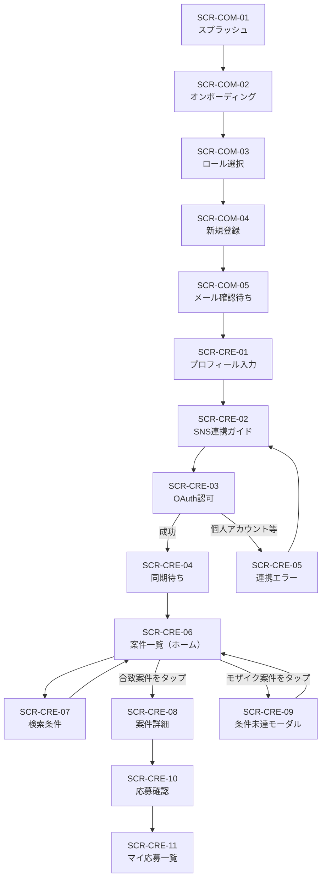
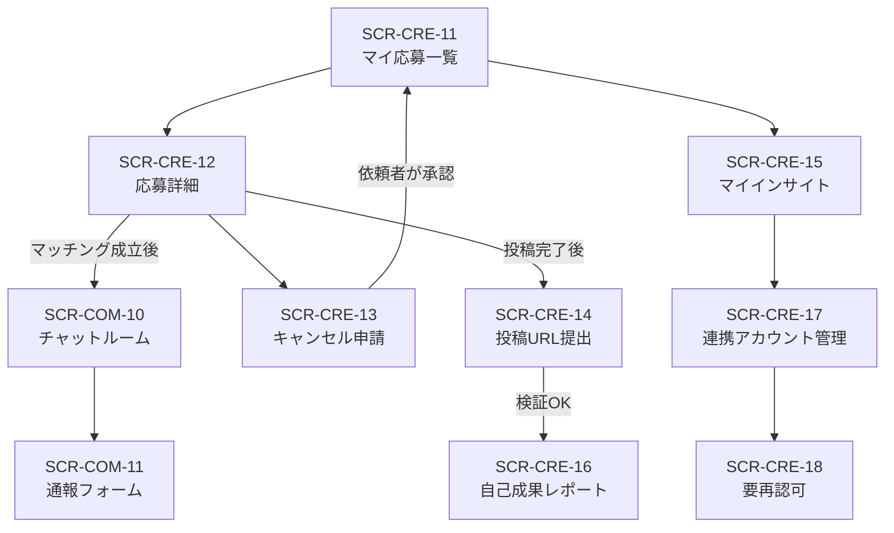
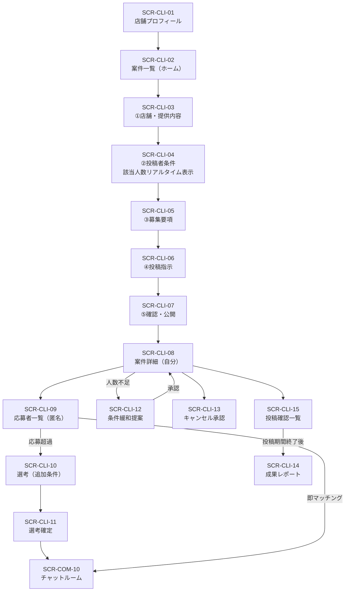
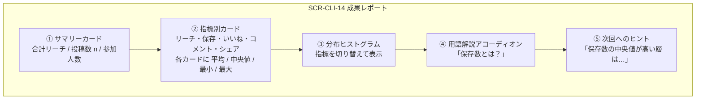

# 6. 画面一覧・画面遷移図

---

## 6-1. 画面 ID の付番

【事実】`SCR-{ロール}-{連番}`。ロール記号は `COM`（共通）/ `CRE`（投稿者）/ `CLI`（PR依頼者）/ `ADM`（運営）。

---

## 6-2. 共通画面（COM）

| ID | 画面名 | 概要 | 関連機能 |
|---|---|---|---|
| `SCR-COM-01` | スプラッシュ | 起動時。セッション判定して遷移先を決める | — |
| `SCR-COM-02` | オンボーディング | サービス説明。**「インサイトは他人に見られない」ことを最初に伝える** | — |
| `SCR-COM-03` | ロール選択 | 「投稿者として始める」「PR依頼者として始める」 | `FR-AUTH-01/02` |
| `SCR-COM-04` | 新規登録 | メール＋パスワード、規約同意 | `FR-AUTH-01/02/11` |
| `SCR-COM-05` | メール確認待ち | 確認メール再送 | `FR-AUTH-03` |
| `SCR-COM-06` | ログイン | | `FR-AUTH-04` |
| `SCR-COM-07` | パスワードリセット | | `FR-AUTH-05` |
| `SCR-COM-08` | 設定 | 通知設定・規約・問い合わせ・ログアウト・退会 | `FR-AUTH-08`, `FR-NOTI-12` |
| `SCR-COM-09` | チャット一覧 | マッチング中の会話一覧、未読バッジ | `FR-MSG-04` |
| `SCR-COM-10` | チャットルーム | 1対1 のやり取り、通報導線 | `FR-MSG-02/03/05/06/07` |
| `SCR-COM-11` | 通報フォーム | 対象・理由・詳細 | `FR-MSG-07` |
| `SCR-COM-12` | アカウント停止中 | 停止理由と問い合わせ導線 | `FR-AUTH-12` |
| `SCR-COM-13` | エラー／オフライン | 再試行導線 | — |

---

## 6-3. 投稿者向け画面（CRE）

| ID | 画面名 | 概要 | 関連機能 |
|---|---|---|---|
| `SCR-CRE-01` | プロフィール入力 | 氏名・生年月日・居住地・自己紹介・得意ジャンル | `FR-AUTH-06/09` |
| `SCR-CRE-02` | SNS連携ガイド | **ビジネス／クリエイターアカウントへの切り替え手順**を図解。連携必須の理由も説明 | `FR-SNS-01` |
| `SCR-CRE-03` | SNS連携（OAuth） | 外部ブラウザで認可 → コールバック | `FR-SNS-01/02` |
| `SCR-CRE-04` | 連携完了・同期待ち | 初回インサイト取得の進捗表示 | `FR-SNS-08` |
| `SCR-CRE-05` | 連携エラー | 個人アカウントの場合の切り替え案内 | `FR-SNS-03` |
| `SCR-CRE-06` | 案件一覧（ホーム） | 合致案件は通常表示、非合致はモザイク。並び順切替 | `FR-SRCH-01/02/07` |
| `SCR-CRE-07` | 案件検索条件 | 都道府県・市区町村・路線駅・現在地から◯km・ジャンル | `FR-SRCH-03/04/05/06` |
| `SCR-CRE-08` | 案件詳細 | **条件合致時のみ**表示。店舗情報・提供内容・期間・必須投稿内容・ハッシュタグ | `FR-SRCH-08` |
| `SCR-CRE-09` | モザイク案件タップ時 | 「条件を満たしていません」モーダル | `FR-SRCH-02` |
| `SCR-CRE-10` | 応募確認 | 必須投稿内容の確認とひとことメッセージ | `FR-APP-01` |
| `SCR-CRE-11` | マイ応募一覧 | 応募中／選考中／マッチング済／投稿待ち／完了 | `FR-SRCH-09` |
| `SCR-CRE-12` | 応募詳細 | 状態、キャンセル申請導線、チャット導線 | `FR-APP-11` |
| `SCR-CRE-13` | キャンセル申請 | 理由入力。承認が必要である旨を明示 | `FR-APP-11` |
| `SCR-CRE-14` | 投稿URL提出 | 投稿後に URL を提出、検証結果を表示 | `FR-APP-14` |
| `SCR-CRE-15` | マイインサイト | **自分だけが見られる**インサイト。最終同期日時を明示 | `FR-INS-09` |
| `SCR-CRE-16` | 自己成果レポート | 自分の案件投稿の実績 | `FR-RPT-07` |
| `SCR-CRE-17` | 連携アカウント管理 | 連携中SNS一覧・再認可・解除 | `FR-SNS-04/06/10` |
| `SCR-CRE-18` | 要再認可バナー／画面 | 失効の説明と再認可導線 | `FR-SNS-06` |

---

## 6-4. PR依頼者向け画面（CLI）

| ID | 画面名 | 概要 | 関連機能 |
|---|---|---|---|
| `SCR-CLI-01` | 店舗プロフィール入力 | 店名・所在地・ジャンル・紹介文・画像 | `FR-AUTH-07` |
| `SCR-CLI-02` | 案件一覧（ホーム） | 自分の案件を状態別に表示 | `FR-CMP-01` |
| `SCR-CLI-03` | 案件作成①店舗・提供内容 | 店舗情報、無償提供内容、想定価格、画像 | `FR-CMP-02/03/11` |
| `SCR-CLI-04` | 案件作成②投稿者条件 | **AND/OR 条件ビルダー＋該当人数のリアルタイム表示** | `FR-CMP-04/05` |
| `SCR-CLI-05` | 案件作成③募集要項 | 応募期間・投稿期間・募集人数・ジャンル | `FR-CMP-06/07/08` |
| `SCR-CLI-06` | 案件作成④投稿指示 | 指定ハッシュタグ（`#PR` は固定）・必須投稿内容 | `FR-CMP-09/10` |
| `SCR-CLI-07` | 案件作成⑤確認・公開 | 入力内容の確認 | `FR-CMP-01` |
| `SCR-CLI-08` | 案件詳細（自分） | 応募状況・残り期間・編集／取り下げ | `FR-CMP-13` |
| `SCR-CLI-09` | 応募者一覧 | **匿名連番のみ**。ひとことメッセージは表示 | `FR-APP-07` |
| `SCR-CLI-10` | 選考（追加条件） | 追加条件を加えて絞り込み。**残り人数のみ表示** | `FR-APP-05` |
| `SCR-CLI-11` | 選考確定確認 | 確定内容の確認 | `FR-APP-06` |
| `SCR-CLI-12` | 条件緩和提案 | システム提案の緩和案（条件緩和／期間延長）を承認・却下 | `FR-APP-08/09` |
| `SCR-CLI-13` | キャンセル申請承認 | 申請理由の確認、承認／却下 | `FR-APP-12` |
| `SCR-CLI-14` | 成果レポート | 匿名集計ダッシュボード（6-6 参照） | `FR-RPT-01`〜`06` |
| `SCR-CLI-15` | 投稿確認一覧 | マッチング者の投稿提出状況 | `FR-APP-14` |

---

## 6-5. 運営向け画面（ADM）

【推奨】初期は Supabase Studio ＋ SQL 運用で代替する案もある（`OI-15`）。以下は専用画面を作る場合の一覧。

| ID | 画面名 | 概要 | 関連機能 |
|---|---|---|---|
| `SCR-ADM-01` | 管理ログイン（MFA） | | `FR-ADM-01` |
| `SCR-ADM-02` | ダッシュボード | 通報件数・新規案件・バッチ状況 | `FR-ADM-08/10` |
| `SCR-ADM-03` | ユーザー管理 | 一覧・検索・停止／解除 | `FR-ADM-02/03` |
| `SCR-ADM-04` | 案件管理 | 一覧・強制停止 | `FR-ADM-04` |
| `SCR-ADM-05` | 通報管理 | 通報一覧・対応ステータス | `FR-ADM-05` |
| `SCR-ADM-06` | 通報チャット閲覧 | super_admin のみ。閲覧時に監査ログを記録 | `FR-ADM-06` |
| `SCR-ADM-07` | 監査ログ | | `FR-ADM-07` |
| `SCR-ADM-08` | 管理者管理 | 招待・権限変更 | `FR-ADM-09` |

---

## 6-6. 画面遷移図

### 6-6-1. 投稿者（初回登録〜応募）

### 6-6-2. 投稿者（マッチング後〜完了）

### 6-6-3. PR依頼者（案件作成〜成果確認）

---

## 6-7. モザイク表示の UI 仕様

【事実】要件「条件に合致しない案件はモザイク表示して存在だけ見せる」を実現する。

| 項目 | 仕様 |
|---|---|
| 表示するもの | 案件カードの形・ジャンルアイコン・大まかなエリア（市区町村まで）・応募締切までの残日数 |
| ぼかすもの | 店名・画像・無償提供の内容・想定価格 |
| タップ時 | 詳細画面には遷移せず、モーダルで「この案件の条件を満たしていません」と表示 |
| 表示しないもの | **どの条件をどれだけ下回っているか**（`OI-29`）。開示すると、複数案件の条件と自分の合否から他者の分布を推測する余地が生まれるため |
| モーダルの導線 | 「インサイトを伸ばすヒント」→ `SCR-CRE-15`（マイインサイト）へ誘導 |
| 一覧内の比率 | 【推奨】合致案件を上位に固定し、モザイク案件は下部にまとめる。全部モザイクだと離脱するため、**合致案件が 0 件のときは「条件を満たす案件がまだありません」の空状態を明示**する |

---

## 6-8. 成果レポート ダッシュボードの UI 提案

【推奨】要件「初見者にも分かりやすく」を満たすための構成案。

| 要素 | 設計意図・匿名性への配慮 |
|---|---|
| ① サマリー | 最初に「合計リーチ」を見せる。PR効果を一目で伝える |
| ② 指標別カード | **平均だけだと外れ値に引きずられる**ため中央値を併記。最小・最大はヒストグラムのビン単位に丸めて表示 |
| ③ ヒストグラム | 件数 5 未満のビンは隣接ビンへ統合。ビン境界は指標ごとの固定値とし、データに応じて動的に変えない（変化から個人を推測されないため） |
| ④ 用語解説 | 初見の PR依頼者に「フォロワー数より保存数」という本アプリの価値観を伝える |
| ⑤ ヒント | 次回の条件設定に誘導する。**個人を特定しない一般化された示唆のみ** |
| n < 5 の場合 | ①〜③を非表示にし、「参加人数が少ないため、個人が特定できないよう詳細は表示していません」と説明する |

---

## 6-9. 画面設計の共通ルール

【推奨】

| # | ルール | 理由 |
|---|---|---|
| U-1 | インサイト数値を表示するすべての画面に**最終同期日時**を明示する | 1日1回更新のため、リアルタイムでないことを誤解させない |
| U-2 | PR依頼者向け画面には**投稿者の実数値を表示する UI コンポーネントを一切実装しない** | 実装が存在しなければ事故も起きない |
| U-3 | 投稿者の表示名は、PR依頼者向け画面では必ず案件内連番のコンポーネントを経由する | 直接 `name` を描画する経路を作らない |
| U-4 | 非同期処理（同期待ち・検証待ち）は必ず進捗と想定所要時間を示す | 待ち時間の離脱を防ぐ |

---

## 本章の未決事項

| ID | タイトル |
|---|---|
| `OI-15` | 運営管理画面の実装形態 |
| `OI-29` | モザイク案件で不足条件を開示するか |
| `OI-33` | デザインシステム／UI キットの選定 |

詳細は [open_issues.md](../open_issues.md) を参照。
