# 7. 主要ユースケース／業務フロー

---

## 7-1. ユースケース一覧

| ID | ユースケース | 主アクター | 関連機能 |
|---|---|---|---|
| `UC-01` | 投稿者が登録し SNS を連携する | creator | `FR-AUTH-01`, `FR-SNS-01`〜`03` |
| `UC-02` | 日次バッチでインサイトを更新する | system | `FR-INS-01`〜`06` |
| `UC-03` | PR依頼者が条件を設定して案件を公開する | client | `FR-CMP-04/05` |
| `UC-04` | 投稿者が案件一覧を見る（モザイク判定） | creator | `FR-SRCH-01/02` |
| `UC-05` | 応募して即マッチングする | creator | `FR-APP-01`〜`03` |
| `UC-06` | 応募者が募集人数を超えて選考する | client | `FR-APP-04`〜`06` |
| `UC-07` | 人数不足で条件緩和を提案・承認する | system / client | `FR-APP-08`〜`10` |
| `UC-08` | 投稿者がキャンセルを申請する | creator / client | `FR-APP-11/12` |
| `UC-09` | 投稿 URL を提出して検証する | creator / system | `FR-APP-14` |
| `UC-10` | PR依頼者が成果レポートを見る | client | `FR-RPT-01`〜`06` |
| `UC-11` | トークン失効から再認可する | system / creator | `FR-SNS-05/06` |
| `UC-12` | 通報を起票し運営が対応する | creator / client / admin | `FR-MSG-07`, `FR-ADM-05/06` |

---

## 7-2. UC-01：投稿者の登録と SNS 連携

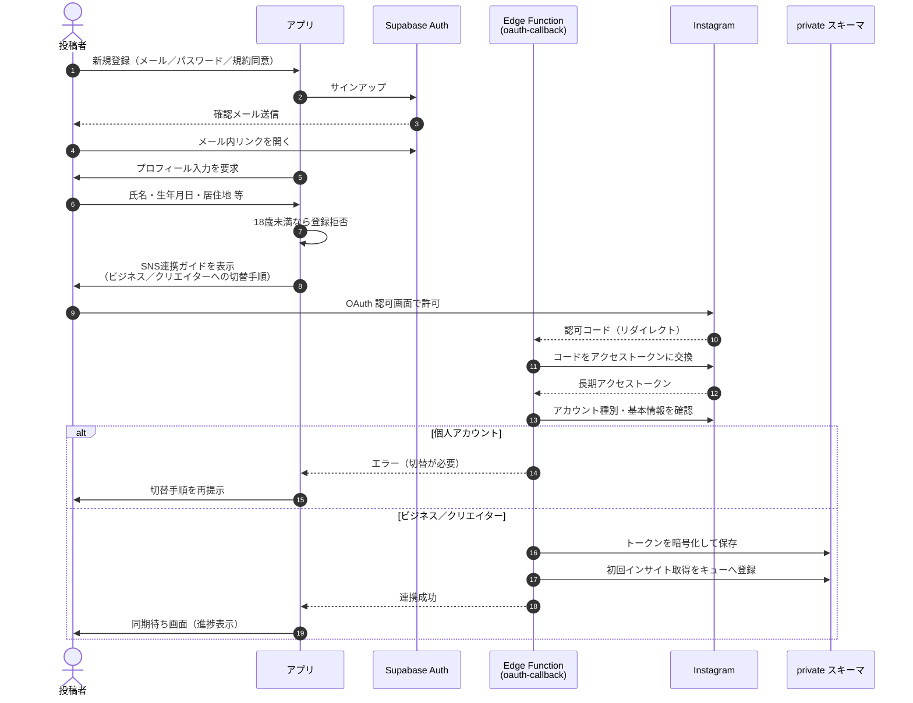

【推奨】OAuth のリダイレクト先は Edge Function（サーバー）とし、**クライアントは認可コードもトークンも一切保持しない**。

---

## 7-3. UC-02：日次インサイト取得バッチ

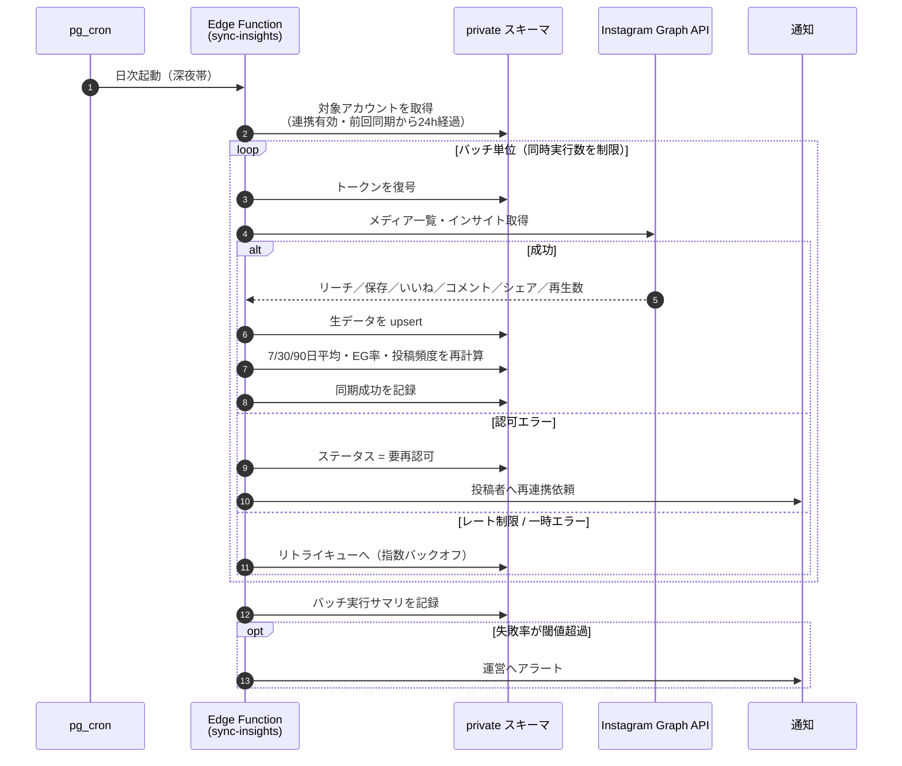

【事実】1 ユーザーの失敗が他ユーザーの処理を止めない（各ユーザーの処理を独立したトランザクションにする）。

---

## 7-4. UC-03：条件設定と案件公開

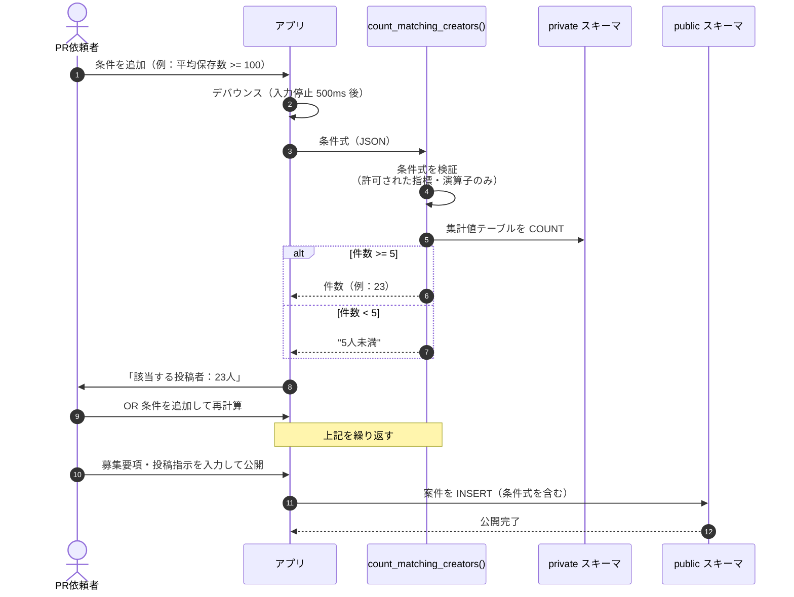

【推奨】条件式は**構造化 JSON**（`{"op":"AND","children":[{"metric":"avg_saves_30d","cmp":">=","value":100}]}` 等）で保存し、生の SQL 文字列は保存しない（SQL インジェクション対策）。RPC 側で許可リストに基づき SQL を組み立てる。

---

## 7-5. UC-04：案件一覧のモザイク判定

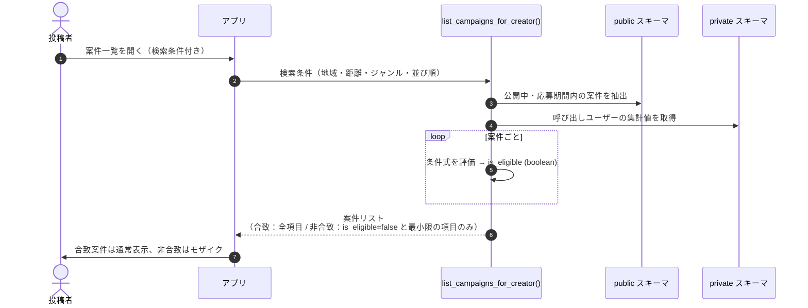

【事実】**非合致案件については、店名・提供内容・想定価格などの詳細フィールドを RPC のレスポンスに含めない**。クライアント側でぼかすだけでは、通信内容から取得できてしまうため。

---

## 7-6. UC-05／UC-06：応募・選考・マッチング

### 状態遷移図：応募（application）

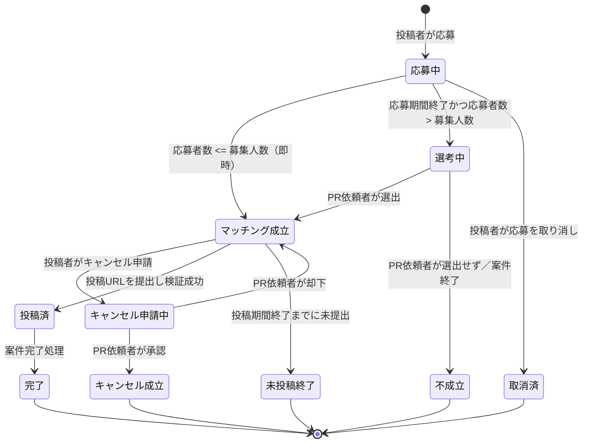

### 状態遷移図：案件（campaign）

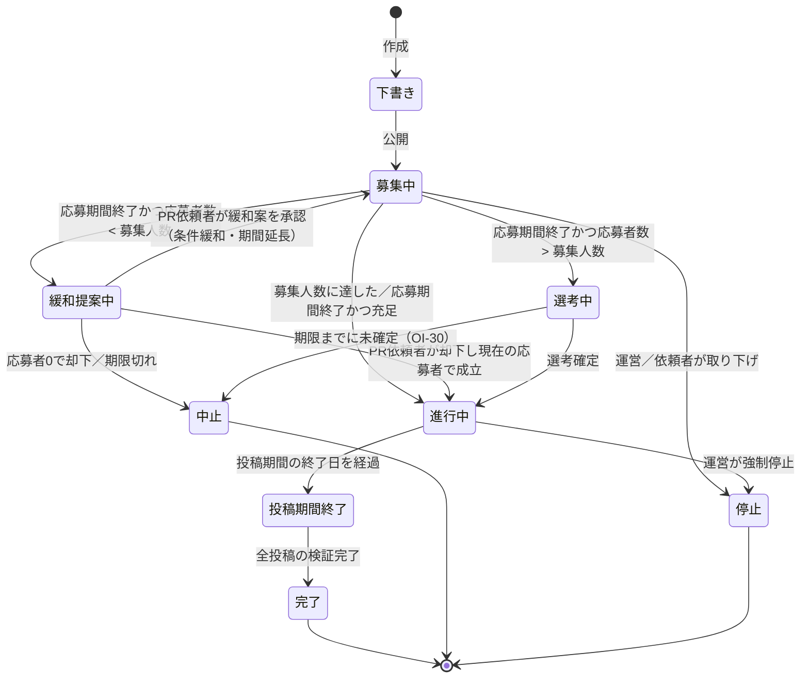

### シーケンス図：UC-05 即マッチング

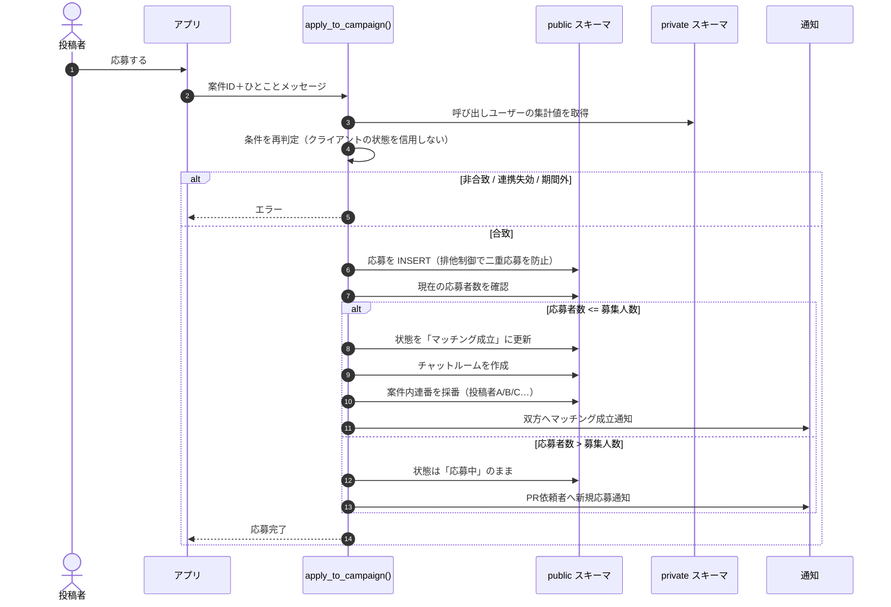

【推奨】「応募者数 ≦ 募集人数なら即マッチング」は、募集人数に達するまで先着順で成立し続けることを意味する。**同時応募による定員超過を防ぐため、応募 INSERT と定員判定を単一トランザクション内で行い、案件行に対して排他ロックを取る**。

### シーケンス図：UC-06 選考

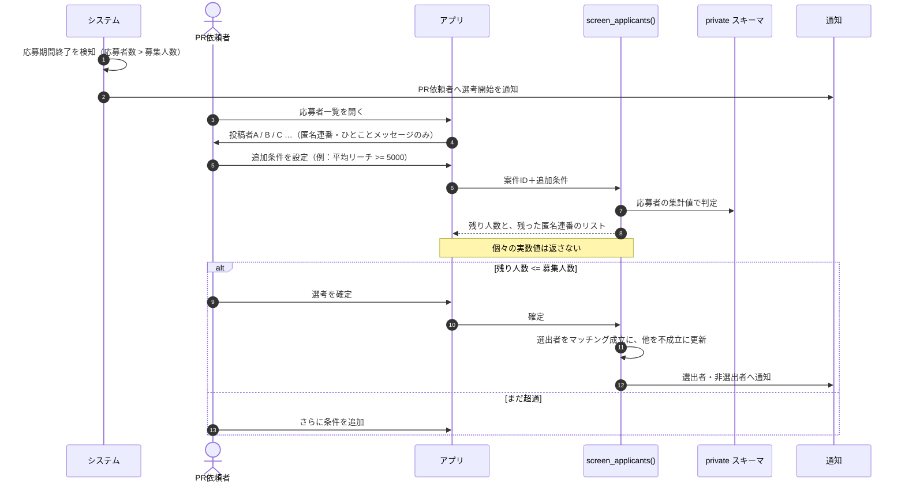

---

## 7-7. UC-07：条件緩和の提案と承認

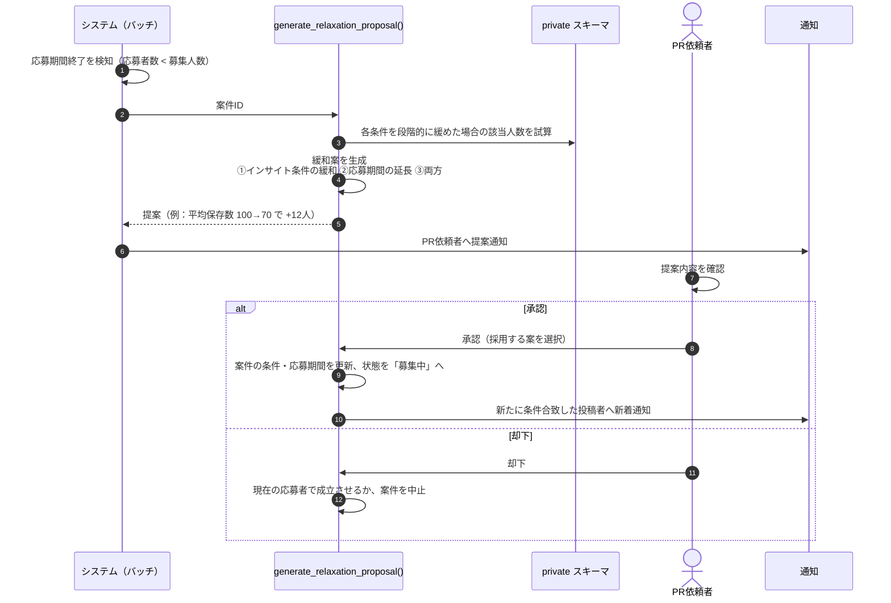

【事実】**承認しなければ緩和は適用されない。** システムが勝手に条件を下げることはない。

【推奨】緩和案の提示は「どの条件をどれだけ緩めると何人増えるか」を示す。ただし**増加人数も 5 人未満は丸める**（`OI-34`）。

---

## 7-8. UC-08：キャンセル申請

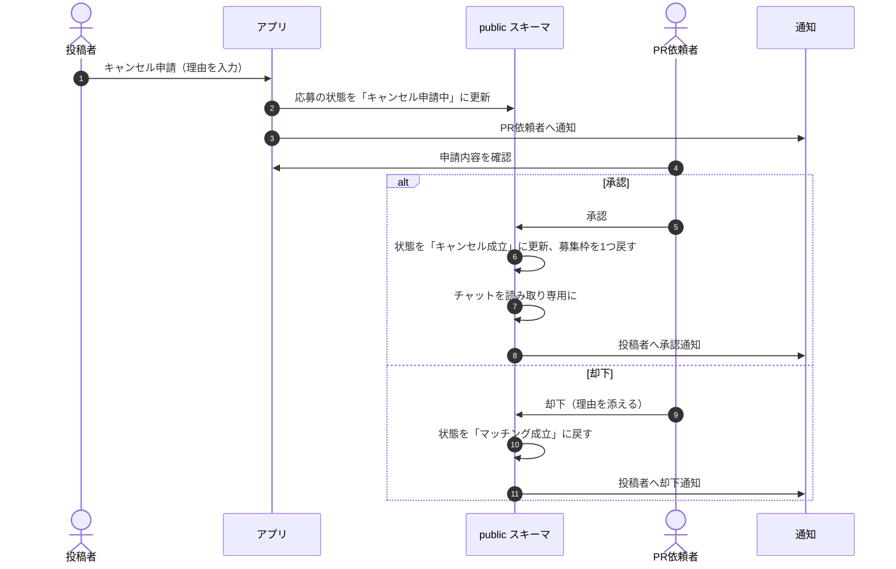

【推奨】却下された場合に投稿者が履行できない状況は残るため、**却下後に一定期間が過ぎても投稿がない場合は自動的に「未投稿終了」とし、運営に記録を残す**運用を推奨する（`OI-31`）。

---

## 7-9. UC-09：投稿 URL の提出と検証

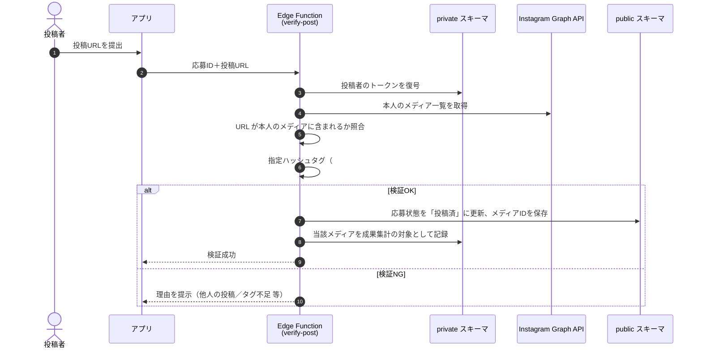

【事実】検証にも本人のトークンを使うため、**本人が連携を解除すると投稿検証ができない**。連携解除の前に警告を出す必要がある。

---

## 7-10. UC-10：成果レポートの閲覧

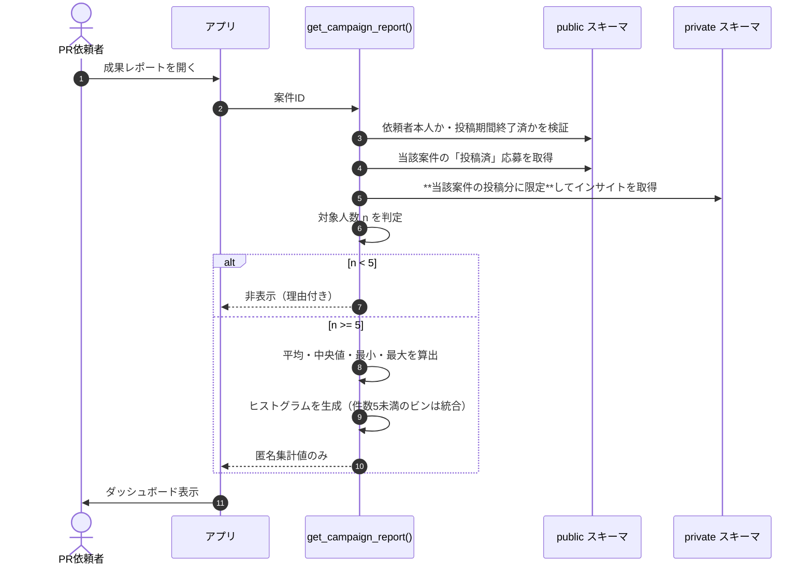

---

## 7-11. UC-11：トークン失効からの再認可

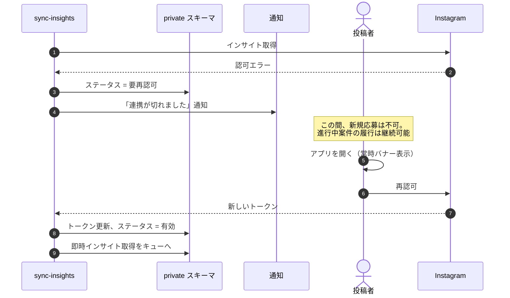

---

## 7-12. UC-12：通報と運営対応

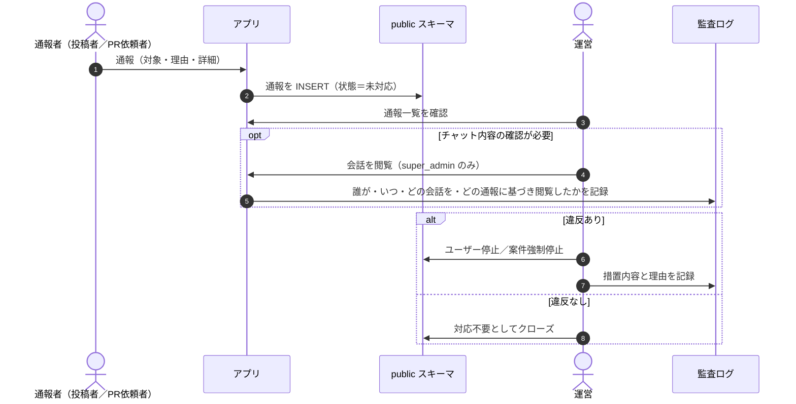

---

## 本章の未決事項

| ID | タイトル |
|---|---|
| `OI-30` | 選考が確定されない場合の期限と自動処理 |
| `OI-31` | キャンセル申請が却下された後の扱い |
| `OI-34` | 緩和提案で「増加人数」を提示する際の丸め方 |

詳細は [open_issues.md](../open_issues.md) を参照。
