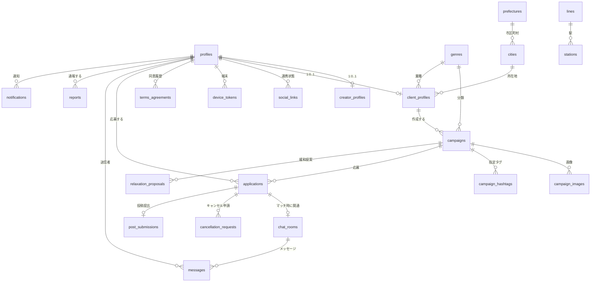
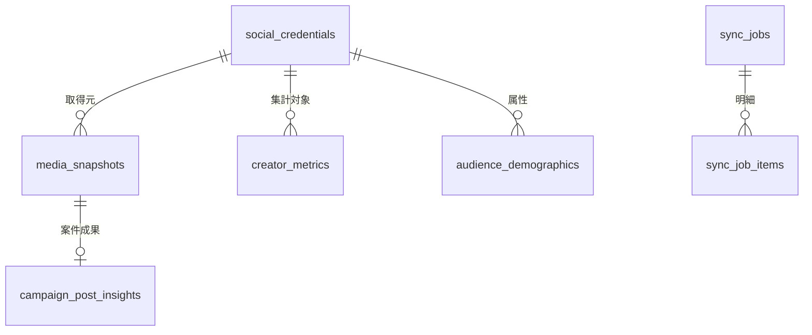

# 8. データモデル

---

## 8-1. 設計原則

【事実】本章の設計は、[02_system_overview.md](02_system_overview.md) 2-4 の「インサイト非開示アーキテクチャ原則」を DB レベルで実現するものである。

| # | 原則 | 実装 |
|---|---|---|
| D-1 | インサイト実数値・SNS トークンは `private` スキーマにのみ置く | `private` に `USAGE` を GRANT しない |
| D-2 | `private` の内容を `public` のテーブル・ビュー・マテビューに写像しない | レビュー時のチェック項目とする |
| D-3 | `public` の全テーブルで RLS を有効にする | `ALTER TABLE ... ENABLE ROW LEVEL SECURITY` |
| D-4 | RLS ポリシーは**デフォルト拒否**。明示的に許可した行だけ見える | ポリシーを 1 つも作らなければ誰も読めない状態が既定 |
| D-5 | 投稿者の氏名等の識別情報は、PR依頼者から見える経路を持たない | `creator_profiles` の RLS は本人と admin のみ |
| D-6 | PR依頼者に見せる投稿者の識別子は、案件内で閉じた連番 | `applications.alias_no` |
| D-7 | 条件式は構造化 JSON で保存し、生の SQL 文字列は保存しない | `campaigns.criteria` は `jsonb` |

---

## 8-2. ER 図（public スキーマ）



## 8-3. ER 図（private スキーマ）



【事実】`private` の各テーブル（8-5 節に定義する 9 テーブル）はいずれも **`public` から外部キーで参照されない**。逆方向（`private` → `public.profiles` の `user_id`）のみ参照する。これにより、`public` 側のクエリから `private` に到達する経路が構造的に存在しない。

---

## 8-4. テーブル定義（public スキーマ）

### 8-4-1. `profiles` — 全ユーザー共通

| カラム | 型 | 制約 | 説明 |
|---|---|---|---|
| `id` | `uuid` | PK, FK → `auth.users.id` | ユーザーID |
| `role` | `text` | NOT NULL, CHECK in (`creator`,`client`,`admin`) | ロール |
| `admin_level` | `text` | NULL, CHECK in (`moderator`,`super_admin`) | admin のみ |
| `status` | `text` | NOT NULL, DEFAULT `pending` | `pending` / `active` / `suspended` / `withdrawn` |
| `suspended_reason` | `text` | NULL | 停止理由 |
| `created_at` / `updated_at` | `timestamptz` | NOT NULL | |

**RLS**：本人は自分の行を SELECT/UPDATE 可。admin は全件 SELECT/UPDATE 可。他者からは不可。

### 8-4-2. `creator_profiles` — 投稿者

| カラム | 型 | 制約 | 説明 |
|---|---|---|---|
| `user_id` | `uuid` | PK, FK → `profiles.id` | |
| `full_name` | `text` | NOT NULL | 氏名。**PR依頼者からは絶対に見えない** |
| `birth_date` | `date` | NOT NULL | 年齢確認用 |
| `prefecture_id` | `int` | FK → `prefectures.id` | 居住地 |
| `bio` | `text` | | 自己紹介 |
| `preferred_genre_ids` | `int[]` | | 得意ジャンル |
| `created_at` / `updated_at` | `timestamptz` | | |

**RLS**：本人と admin のみ。**`client` ロールには SELECT ポリシーを一切作らない。**

### 8-4-3. `client_profiles` — PR依頼者（店舗）

| カラム | 型 | 制約 | 説明 |
|---|---|---|---|
| `user_id` | `uuid` | PK, FK → `profiles.id` | |
| `store_name` | `text` | NOT NULL | 店名 |
| `genre_id` | `int` | FK → `genres.id` | 業種 |
| `postal_code` | `text` | | |
| `prefecture_id` | `int` | FK → `prefectures.id` | |
| `city_id` | `int` | FK → `cities.id` | |
| `address_line` | `text` | | 番地以降 |
| `location` | `geography(Point,4326)` / `point` | | ジオコーディング結果（距離検索用） |
| `nearest_station_id` | `int` | FK → `stations.id`, NULL | |
| `description` | `text` | | 紹介文 |
| `contact_email` | `text` | | |
| `created_at` / `updated_at` | `timestamptz` | | |

**RLS**：本人・admin は全項目。`creator` は SELECT 可（案件詳細に必要）だが `contact_email` は除外したビュー経由とする。

### 8-4-4. `social_links` — SNS 連携状態（**実数値・トークンは含まない**）

| カラム | 型 | 制約 | 説明 |
|---|---|---|---|
| `id` | `uuid` | PK | |
| `user_id` | `uuid` | FK → `profiles.id` | |
| `platform` | `text` | NOT NULL, CHECK in (`instagram`,`tiktok`,`youtube`) | |
| `status` | `text` | NOT NULL | `active` / `reauth_required` / `revoked` |
| `linked_at` | `timestamptz` | | |
| `last_synced_at` | `timestamptz` | NULL | 「最終同期日時」の表示に使用 |
| | | UNIQUE(`user_id`,`platform`) | |

**RLS**：本人と admin のみ。

> 【事実】このテーブルには**フォロワー数も含めていかなる数値も置かない**。連携済みか否かと最終同期日時のみ。

### 8-4-5. `campaigns` — 案件

| カラム | 型 | 制約 | 説明 |
|---|---|---|---|
| `id` | `uuid` | PK | |
| `client_id` | `uuid` | FK → `client_profiles.user_id` | |
| `status` | `text` | NOT NULL | `draft`/`recruiting`/`screening`/`relaxation_proposed`/`in_progress`/`posting_closed`/`completed`/`cancelled`/`suspended` |
| `title` | `text` | NOT NULL | |
| `store_name_snapshot` | `text` | NOT NULL | 公開時点の店名を保存（後の店名変更で過去案件が変わらないように） |
| `genre_id` | `int` | FK → `genres.id` | |
| `reward_description` | `text` | NOT NULL | 無償提供内容 |
| `reward_value_jpy` | `int` | NOT NULL, CHECK >= 0 | 想定価格（並び順に使用） |
| `reward_type` | `text` | NOT NULL, DEFAULT `in_kind` | **将来拡張用**：`in_kind` / `paid`（初期は `in_kind` のみ） |
| `criteria` | `jsonb` | NOT NULL | 投稿者条件式（8-6 参照） |
| `original_criteria` | `jsonb` | NULL | 緩和前の条件（監査用） |
| `quota` | `int` | NOT NULL, CHECK >= 1 | 募集人数 |
| `apply_start_at` / `apply_end_at` | `timestamptz` | NOT NULL | 応募期間 |
| `post_start_at` / `post_end_at` | `timestamptz` | NOT NULL | 投稿期間 |
| `required_content` | `text` | NOT NULL | 必須投稿内容 |
| `prefecture_id` / `city_id` | `int` | FK | 検索用（店舗から複製） |
| `location` | `geography(Point,4326)` | | 距離検索用 |
| `nearest_station_id` | `int` | FK, NULL | |
| `published_at` | `timestamptz` | NULL | |
| `created_at` / `updated_at` | `timestamptz` | | |

**制約**：`apply_end_at <= post_start_at`、`post_start_at < post_end_at`。

**RLS**：
- `client`：自分の案件のみ全操作。
- `creator`：**直接 SELECT させない**。案件の閲覧は必ず `list_campaigns_for_creator()` / `get_campaign_detail()` の RPC 経由とする。理由：`criteria` を直接読めると、他者の分布推測や条件回避の材料になるため。
- `admin`：全件 SELECT / 停止。

### 8-4-6. `campaign_images` / `campaign_hashtags`

| テーブル | 主なカラム |
|---|---|
| `campaign_images` | `id`, `campaign_id`, `storage_path`, `sort_order` |
| `campaign_hashtags` | `id`, `campaign_id`, `tag`（`#` を含まない文字列）, `is_mandatory`（`#PR` 等の削除不可タグは `true`） |

### 8-4-7. `applications` — 応募

| カラム | 型 | 制約 | 説明 |
|---|---|---|---|
| `id` | `uuid` | PK | |
| `campaign_id` | `uuid` | FK → `campaigns.id` | |
| `creator_id` | `uuid` | FK → `profiles.id` | |
| `alias_no` | `int` | NOT NULL | **案件内で閉じた連番**（1,2,3…）。PR依頼者には「投稿者A/B/C…」として表示 |
| `status` | `text` | NOT NULL | `applied`/`screening`/`matched`/`rejected`/`withdrawn`/`cancel_requested`/`cancelled`/`posted`/`no_post`/`completed` |
| `message` | `text` | | 応募時のひとこと |
| `matched_at` | `timestamptz` | NULL | |
| `created_at` / `updated_at` | `timestamptz` | | |
| | | UNIQUE(`campaign_id`,`creator_id`) | 二重応募の防止 |
| | | UNIQUE(`campaign_id`,`alias_no`) | 連番の一意性 |

**RLS**：
- `creator`：`creator_id = auth.uid()` の行のみ。
- `client`：自分の案件の応募のみ。ただし **`creator_id` を含むカラムは返さないビュー**（`v_applications_for_client`）経由でアクセスさせ、`alias_no` のみ見せる。
- `admin`：全件。

> 【推奨】`client` が `applications` を直接 SELECT できると `creator_id` が取得でき、複数案件をまたいだ名寄せが可能になる。**必ずビューまたは RPC を経由させ、`creator_id` を露出しない。**

### 8-4-8. `chat_rooms` / `messages`

| テーブル | 主なカラム |
|---|---|
| `chat_rooms` | `id`, `application_id`（UNIQUE, FK）, `is_readonly`（案件完了後 true）, `created_at` |
| `messages` | `id`, `room_id`, `sender_id`（FK → `profiles.id`）, `body`, `image_path`, `read_at`, `created_at` |

**RLS**：`chat_rooms` は当該応募の投稿者本人と案件の依頼者のみ。`messages` も同様。**admin は既定では読めない**。通報がある会話に限り `super_admin` が RPC 経由で閲覧し、その RPC が監査ログを書く。

【推奨】PR依頼者側の画面では `sender_id` を直接表示せず、`sender_id = 自分` かどうかだけで自分／相手を判定する。相手の表示名は `alias_no` から生成する。

### 8-4-9. `cancellation_requests`

| カラム | 説明 |
|---|---|
| `id`, `application_id`（FK）, `reason`, `status`（`pending`/`approved`/`rejected`）, `decided_at`, `decided_reason`, `created_at` |

### 8-4-10. `relaxation_proposals` — 条件緩和提案

| カラム | 説明 |
|---|---|
| `id`, `campaign_id`（FK） |
| `proposed_criteria` `jsonb` — 緩和後の条件式 |
| `proposed_apply_end_at` `timestamptz` — 延長後の応募期限 |
| `estimated_additional_creators` `int` — 増加見込み人数（**5 未満は丸める**、`OI-34`） |
| `status` — `pending`/`approved`/`rejected`/`expired` |
| `expires_at`, `decided_at`, `created_at` |

**RLS**：当該案件の `client` と `admin` のみ。

### 8-4-11. `post_submissions` — 投稿提出

| カラム | 説明 |
|---|---|
| `id`, `application_id`（UNIQUE, FK）, `post_url`, `external_media_id`, `verified`（bool）, `verified_at`, `verify_error`, `created_at` |

> 【事実】`external_media_id` は「どの投稿か」の識別子であり、**インサイト実数値ではない**ため `public` に置いてよい。ただし `client` には見せない（投稿URLから投稿者本人が特定できてしまうため）。**`client` 側には「提出済み／検証済み」の boolean のみ**を見せる。

### 8-4-12. `reports` — 通報

| カラム | 説明 |
|---|---|
| `id`, `reporter_id`, `target_type`（`user`/`campaign`/`message`）, `target_id`, `reason_code`, `detail`, `status`（`open`/`in_review`/`closed`）, `created_at` |

### 8-4-13. マスタ・補助テーブル

| テーブル | 説明 |
|---|---|
| `genres` | ジャンル（飲食・美容 等）。`id`, `name`, `sort_order` |
| `prefectures` / `cities` | 都道府県・市区町村マスタ |
| `lines` / `stations` | 路線・駅マスタ（`OI-10`） |
| `device_tokens` | プッシュ通知用。`user_id`, `token`, `platform`, `updated_at` |
| `notifications` | アプリ内通知。`user_id`, `type`, `payload jsonb`, `read_at` |
| `terms_agreements` | 規約同意履歴。`user_id`, `terms_version`, `agreed_at` |
| `favorites` | お気に入り（Could）。`user_id`, `campaign_id` |

---

## 8-5. テーブル定義（private スキーマ）

【事実】以下はすべて **`anon` / `authenticated` に GRANT しない**。アクセスできるのは `service_role` と `SECURITY DEFINER` 関数のみ。

### 8-5-1. `private.social_credentials`

| カラム | 型 | 説明 |
|---|---|---|
| `id` | `uuid` | PK |
| `user_id` | `uuid` | → `public.profiles.id` |
| `platform` | `text` | `instagram` / `tiktok` / `youtube` |
| `external_account_id` | `text` | プラットフォーム側のアカウントID |
| `account_type` | `text` | `business` / `creator` / `personal` |
| `access_token_encrypted` | `bytea` | **暗号化必須**。AES-256-GCM + Supabase Secrets の鍵で暗号化（`OI-17` 決定済み、ADR-0006） |
| `refresh_token_encrypted` | `bytea` | NULL 可 |
| `token_expires_at` | `timestamptz` | 自動更新の判定に使用 |
| `scopes` | `text[]` | 付与されたスコープ |
| `status` | `text` | `active` / `reauth_required` / `revoked` |
| `created_at` / `updated_at` | `timestamptz` | |

### 8-5-2. `private.media_snapshots` — 投稿単位の生データ

| カラム | 型 | 説明 |
|---|---|---|
| `id` | `uuid` | PK |
| `credential_id` | `uuid` | FK |
| `external_media_id` | `text` | |
| `media_type` | `text` | `image`/`video`/`reel`/`carousel`/`story` |
| `posted_at` | `timestamptz` | |
| `reach` / `impressions` / `likes` / `comments` / `saves` / `shares` / `views` | `int` | **実数値。ここが最も機微** |
| `fetched_at` | `timestamptz` | |
| | | UNIQUE(`credential_id`,`external_media_id`) |

### 8-5-3. `private.creator_metrics` — 集計値（マッチング判定の対象）

| カラム | 型 | 説明 |
|---|---|---|
| `user_id` | `uuid` | PK の一部 |
| `platform` | `text` | PK の一部 |
| `window_days` | `int` | PK の一部。`7` / `30` / `90` |
| `followers` | `int` | フォロワー数 |
| `avg_reach` / `avg_impressions` / `avg_likes` / `avg_comments` / `avg_saves` / `avg_shares` / `avg_views` | `numeric` | 期間内平均 |
| `engagement_rate` | `numeric` | `(likes+comments+saves+shares) / reach` |
| `post_count` | `int` | 期間内の投稿本数（投稿頻度） |
| `computed_at` | `timestamptz` | |

【推奨】条件判定はこのテーブルのみを参照する。`window_days` を含む複合インデックスと、指標ごとの部分インデックスを張る。

### 8-5-4. `private.audience_demographics`

| カラム | 説明 |
|---|---|
| `user_id`, `platform`, `dimension`（`gender`/`age`/`city`/`country`）, `bucket`（`female`/`25-34`/`東京都` 等）, `ratio numeric`, `computed_at` |

### 8-5-5. `private.campaign_post_insights` — 案件成果分のみ

| カラム | 説明 |
|---|---|
| `id`, `application_id`（→ `public.applications.id`）, `campaign_id`, `media_snapshot_id`, `measured_at` |

【事実】成果レポートは**このテーブルに紐づく `media_snapshots` のみ**を集計対象とする。「案件に関係ない過去投稿は開示しない」という要件を、集計クエリの WHERE 句ではなく**テーブル構造**で保証する。

### 8-5-6. `private.campaign_report_snapshots` — 成果レポートの集計スナップショット

| カラム | 説明 |
|---|---|
| `campaign_id`（主キー、→ `public.campaigns.id`）, `participant_num`, `summary jsonb`, `created_at` |

【事実】k-匿名性を満たす集計値のみを含むため個人情報を含まない。生データ（`media_snapshots`）削除後もレポート表示に使える。

### 8-5-7. `private.sync_jobs` / `private.sync_job_items`

| テーブル | 主なカラム |
|---|---|
| `sync_jobs` | `id`, `started_at`, `finished_at`, `target_count`, `success_count`, `failure_count` |
| `sync_job_items` | `id`, `job_id`, `credential_id`, `status`（`pending`/`success`/`failed`/`retry`）, `attempt`, `next_retry_at`, `error_code`, `error_message` |

### 8-5-8. `private.audit_logs`

| カラム | 説明 |
|---|---|
| `id`, `actor_id`, `action`（`suspend_user`/`view_reported_chat` 等）, `target_type`, `target_id`, `context jsonb`, `created_at` |

【事実】アプリケーションから DELETE / UPDATE できないようにする（該当権限を付与しない）。

---

## 8-6. 条件式（`campaigns.criteria`）の仕様

【推奨】以下の構造化 JSON とする。

```json
{
  "op": "AND",
  "children": [
    { "metric": "avg_saves", "platform": "instagram", "window": 30, "cmp": ">=", "value": 100 },
    {
      "op": "OR",
      "children": [
        { "metric": "avg_reach", "platform": "instagram", "window": 30, "cmp": ">=", "value": 3000 },
        { "metric": "followers", "platform": "instagram", "window": 30, "cmp": ">=", "value": 5000 }
      ]
    }
  ]
}
```

| 項目 | 許可値 |
|---|---|
| `op` | `AND` / `OR`（ネスト可。深さの上限は 3 を推奨） |
| `metric` | `followers`, `avg_reach`, `avg_impressions`, `avg_likes`, `avg_comments`, `avg_saves`, `avg_shares`, `avg_views`, `engagement_rate`, `post_count` |
| `platform` | `instagram`（初期）／将来 `tiktok`, `youtube` |
| `window` | `7` / `30` / `90` |
| `cmp` | `>=` / `<=` / `>` / `<` / `=` |
| `value` | 数値。指標ごとに上下限を検証する |

【事実】**RPC 側で許可リストに基づいて検証し、リストにないキーが含まれる条件式は拒否する**。ユーザー入力を SQL 文字列として連結しない（SQL インジェクション対策）。

【推奨】オーディエンス属性（性別・年齢・地域）を条件に使う場合は `metric` ではなく別の `audience` ノード型として定義する。初期スコープでは条件に含めない（`OI-35`）。

---

## 8-7. インサイト非開示を担保する設計まとめ

| 要件 | 担保方法 |
|---|---|
| PR依頼者は個々の実数値を閲覧できない | 実数値は `private` にのみ存在し、GRANT がない |
| クライアントから `private` に到達できない | `public` → `private` の外部キー・ビュー・関数の戻り値型のいずれにも実数値が現れない |
| 条件は指定できる | `campaigns.criteria`（`public`）に条件式のみ保存し、判定は RPC 内で行う |
| 該当人数は見える | RPC が integer のみ返す。5 未満は丸める |
| 成果は集計のみ見える | `campaign_post_insights` に紐づく分だけを集計し、n < 5 は非表示 |
| 個人特定ができない | `applications.alias_no`（案件内連番）のみを PR依頼者に露出。`creator_id` はビュー・RPC で遮断 |
| 名寄せができない | `alias_no` は案件ごとに独立採番。同一人物でも案件が違えば別の番号 |

---

## 8-8. インデックス方針（抜粋）

| テーブル | インデックス | 目的 |
|---|---|---|
| `campaigns` | `(status, apply_end_at)` | 募集中案件の抽出 |
| `campaigns` | `(prefecture_id, city_id)` / GiST(`location`) | 地域・距離検索 |
| `campaigns` | `(reward_value_jpy DESC)`, `(published_at DESC)` | 並び順 |
| `applications` | `(campaign_id, status)` | 応募者数のカウント |
| `messages` | `(room_id, created_at DESC)` | チャット表示 |
| `private.creator_metrics` | `(platform, window_days)` ＋ 各指標の B-tree | 条件マッチングの高速化 |
| `private.media_snapshots` | `(credential_id, posted_at DESC)` | 集計値の再計算 |

---

## 本章の未決事項

| ID | タイトル |
|---|---|
| `OI-09` | ジオコーディング手段と距離検索の実装（PostGIS / earthdistance） |
| `OI-10` | 路線・駅マスタのデータソースとライセンス |
| ~~`OI-17`~~ | ~~トークン暗号化の方式と鍵管理~~ → **決定済み**（AES-256-GCM + Supabase Secrets、ADR-0006） |
| `OI-35` | オーディエンス属性を条件に使えるようにするか |
| `OI-36` | 退会・連携解除時のインサイト削除と、過去案件レポートの整合性 |

詳細は [open_issues.md](../open_issues.md) を参照。
