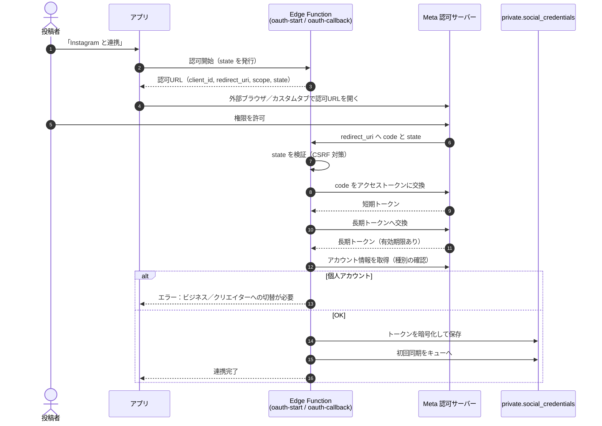
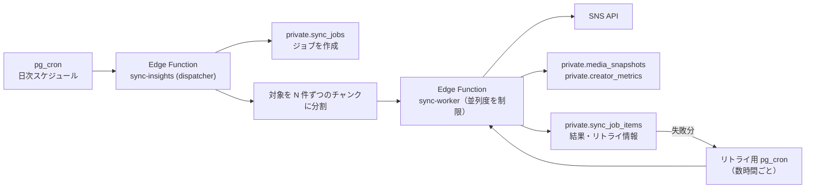

# 9. 外部連携仕様

【事実】本章の API 仕様は変動する。**実装着手時に必ず各プラットフォームの公式ドキュメント（一次情報）で再確認すること。** 本章に「要確認」と記した箇所は特に変動しやすい。

---

## 9-1. 連携方針

| # | 方針 | ラベル |
|---|---|---|
| X-1 | インサイト取得は**公式 API のみ**を使用する。スクレイピングは行わない | 【事実】 |
| X-2 | すべての SNS 連携は**投稿者本人の OAuth 認可**を前提とする | 【事実】 |
| X-3 | アクセストークンは**サーバー（Edge Function）でのみ扱う**。クライアントに渡さない | 【推奨】 |
| X-4 | 初期リリースは **Instagram のみ**。DB・コードは複数プラットフォーム前提で汎化する | 【前提】（`OI-02`） |
| X-5 | API 呼び出しは**すべて日次バッチ経由**。ユーザー操作を契機とした同期呼び出しは、連携直後の初回取得と投稿検証に限る | 【推奨】 |

---

## 9-2. 指標 × プラットフォーム 取得可否

【事実】〇＝取得可、△＝条件付き／要確認、×＝不可。**すべて本人の OAuth 認可が前提**。

| # | 指標 | 本アプリの内部名 | Instagram | TikTok | YouTube | 備考 |
|---|---|---|---|---|---|---|
| 1 | フォロワー数 | `followers` | 〇 | 〇 | 〇（登録者数） | |
| 2 | 平均いいね数 | `avg_likes` | 〇 | 〇 | 〇 | 投稿単位の値を期間平均 |
| 3 | 平均リーチ | `avg_reach` | 〇 | △ 要確認 | × | **リーチ＝ユニーク到達数** |
| 4 | 平均インプレッション | `avg_impressions` | 〇 | △ 要確認 | 〇（視聴回数） | **延べ表示回数** |
| 5 | 平均保存数 | `avg_saves` | 〇 | △ 要確認 | × | **本アプリの中核指標** |
| 6 | 平均コメント数 | `avg_comments` | 〇 | 〇 | 〇 | |
| 7 | 平均シェア数 | `avg_shares` | 〇 | 〇 | △ 要確認 | |
| 8 | 平均再生数（動画／リール） | `avg_views` | 〇 | 〇 | 〇 | |
| 9 | エンゲージメント率 | `engagement_rate` | 〇（算出） | △（分母が異なる） | △（分母が異なる） | 9-3 参照 |
| 10 | 過去 N 日平均（7/30/90） | `window_days` | 〇（算出） | 〇（算出） | 〇（算出） | 本アプリ側で算出 |
| 11 | オーディエンス属性（性別・年齢・地域） | `audience_demographics` | 〇 | △ 要確認 | 〇 | 本人認可時のみ |
| 12 | 投稿頻度 | `post_count` | 〇（算出） | 〇（算出） | 〇（算出） | 本アプリ側で算出 |

【重要】**プラットフォームによって取得できる指標が異なるため、案件の条件式は「プラットフォーム＋指標」の組で指定する**（8-6 の `criteria` に `platform` を含めている理由）。「Instagram の平均保存数」と「TikTok の平均保存数」を同一の条件として扱わない。

---

## 9-3. エンゲージメント率の定義

【推奨】プラットフォーム間で分母が揃わないため、以下のとおり定義を固定する。

| プラットフォーム | 定義 | 備考 |
|---|---|---|
| Instagram | `(いいね + コメント + 保存 + シェア) ÷ リーチ` | 実際に届いた範囲に対する反応率。フォロワー数を分母にしない |
| TikTok | 取得可能な指標に応じて `(いいね + コメント + シェア) ÷ 再生数` | 分母が異なるため **Instagram の値と直接比較しない** |
| YouTube | `(高評価 + コメント) ÷ 視聴回数` | 同上 |

【事実】UI 上でも「Instagram のエンゲージメント率」と明示し、プラットフォームをまたいだ比較・平均を行わない。

---

## 9-4. Instagram 連携仕様

### 9-4-1. 前提

| 項目 | 内容 |
|---|---|
| API | Instagram Graph API（Basic Display API は 2024年12月に廃止） |
| 必要なアカウント | ビジネスアカウント または クリエイターアカウント |
| 付随条件 | Facebook ページとの連携 |
| 本番公開 | Meta のアプリ審査が必須（目安 2〜4 週間） |
| 主なレート制限 | 200 リクエスト / ユーザー / 時（目安、要確認） |

### 9-4-2. 認可フロー

【推奨】必要なスコープは**最小限**に絞る（インサイト取得とメディア読み取りに必要なものだけ）。Meta の審査では「なぜそのスコープが必要か」の説明が求められるため、過剰なスコープ要求は審査落ちの原因になる。

### 9-4-3. 取得する項目

| 種別 | 取得内容 | 保存先 |
|---|---|---|
| アカウント | アカウントID・ユーザー名・アカウント種別・フォロワー数 | `private.social_credentials` / `private.creator_metrics` |
| メディア一覧 | メディアID・種別・投稿日時・パーマリンク | `private.media_snapshots` |
| メディアインサイト | リーチ・インプレッション・いいね・コメント・保存・シェア・再生数 | `private.media_snapshots` |
| オーディエンス | 性別・年齢帯・地域の分布 | `private.audience_demographics` |

【事実】メディアインサイトは**投稿からの経過時間によって取得できる指標が変わる**場合がある（要確認）。取得できなかった指標は `NULL` とし、集計時は `NULL` を除外して平均を取る。

### 9-4-4. トークン管理

| 項目 | 方針 |
|---|---|
| 保存 | `private.social_credentials.access_token_encrypted` に暗号化して保存（`OI-17`） |
| 有効期限 | `token_expires_at` を保持し、期限の N 日前にバッチで自動更新（`FR-SNS-07`） |
| 失効検知 | API 呼び出しで認可エラーを受けたら `status = reauth_required` に更新し、投稿者へ通知 |
| 失効時の挙動 | 新規応募を不可にする。進行中案件のチャット・投稿は継続可能 |
| 連携解除 | トークンを削除し、`private` のインサイトデータも削除（`FR-INS-13`、`OI-36`） |

---

## 9-5. TikTok 連携仕様（将来）

| 項目 | 内容 |
|---|---|
| API | Login Kit ＋ Display API |
| 認可 | ユーザー OAuth 認可 |
| 審査 | TikTok for Developers のアプリ審査（要確認） |
| 取得可能指標 | 9-2 の表を参照。**保存数・リーチの取得可否は要確認** |
| 実装時期 | `OI-02` / `OI-18` |

---

## 9-6. YouTube 連携仕様（将来）

| 項目 | 内容 |
|---|---|
| API | YouTube Data API v3 ＋ YouTube Analytics API |
| 認可 | OAuth 2.0（非公開データには必須） |
| 費用 | 無料 |
| クォータ | **1日 10,000 クォータ単位（プロジェクト単位）**。緩和には申請が必要 |
| クォータ設計上の注意 | ユーザー単位ではなく**プロジェクト単位**の上限のため、**ユーザー数の増加が直接上限に効く**。Instagram（ユーザー単位）とは設計が異なる |
| 実装時期 | `OI-02` / `OI-18` |

【推奨】YouTube 対応時は、1 ユーザーあたりの 1 日の消費クォータを見積もり、上限到達時に**当日の残りユーザーを翌日へ繰り越す**設計にする。

---

## 9-7. 日次バッチ設計

### 9-7-1. 構成

【事実】決定事項：**Supabase `pg_cron` が Edge Function を起動する**。

### 9-7-2. 実行パラメータ（推奨初期値）

| 項目 | 初期値 | 根拠 |
|---|---|---|
| 実行時刻 | 毎日 03:00 JST | 利用が最も少ない時間帯 |
| 同時実行数 | 5 アカウント | Edge Function の実行時間上限に収める |
| 1 アカウントあたりの取得メディア数 | 直近 90 日分（上限 100 件） | 90 日平均の算出に必要な範囲 |
| リトライ回数 | 最大 5 回 | |
| バックオフ | 指数（5分 → 15分 → 45分 → 2時間 → 6時間） | レート制限の回復を待つ |
| タイムアウト | 1 アカウントあたり 30 秒 | |
| 失敗率アラート閾値 | 10% | 運営へ通知 |

【推奨】ユーザー数が数百人規模になるまでは、1 回の実行で全ユーザーを処理できる。**数千人規模になったら、ユーザーを曜日やハッシュで分散して「全員を毎日更新しない」方式への移行**を検討する（条件マッチングの鮮度要件は「1日1回」なので、当面は不要）。

### 9-7-3. レート制限への対応

| プラットフォーム | 制限 | 対応 |
|---|---|---|
| Instagram | 200 req / ユーザー / 時（目安） | ユーザー単位の制限のため、**ユーザーをまたいだ並列実行は制限に抵触しにくい**。1 ユーザーあたりの呼び出し回数を 20 回程度に抑える設計にする |
| TikTok | 要確認 | 実装時に確認 |
| YouTube | 10,000 quota / 日 / プロジェクト | **プロジェクト単位**のため、消費量を記録し、上限の 80% で当日の処理を打ち切って翌日へ繰り越す |

### 9-7-4. 失敗時のハンドリング

| 失敗種別 | 判定 | 対応 |
|---|---|---|
| 認可エラー | トークン失効・権限剥奪 | `status = reauth_required`、投稿者へ通知、リトライしない |
| レート制限 | HTTP 429 / 該当エラーコード | リトライキューへ（バックオフ） |
| 一時障害 | 5xx / タイムアウト | リトライキューへ |
| データ不整合 | 想定外のレスポンス形式 | 当該アカウントをスキップし、エラー内容を記録して運営へ通知 |
| アカウント種別変更 | ビジネス → 個人に戻された | `status = reauth_required` とし、切替を依頼する通知 |

【事実】**1 アカウントの失敗が他アカウントの処理を止めない。** 各アカウントの処理を独立させ、例外を握りつぶさず `sync_job_items` に記録する。

---

## 9-8. 投稿検証 API 呼び出し

【推奨】`FR-APP-14` の投稿検証は、日次バッチとは別に**投稿者の提出を契機として同期実行**する。

| 項目 | 内容 |
|---|---|
| 呼び出し元 | Edge Function `verify-post` |
| 使用トークン | 投稿者本人のトークン |
| 検証内容 | ① 提出 URL が本人のメディアに存在するか ② 指定ハッシュタグ（`#PR` を含む）が本文に含まれるか ③ 投稿日時が投稿期間内か |
| 失敗時 | 理由を投稿者に提示し、再提出を許可する |
| 成果集計への登録 | 検証成功時に `private.campaign_post_insights` へ登録し、以後の日次バッチで数値を更新する |

---

## 9-9. Meta アプリ審査の準備物

【推奨】審査に必要と想定される準備物を先行して用意する（`OI-01`）。

| # | 準備物 | 備考 |
|---|---|---|
| 1 | プライバシーポリシー URL | 公開必須。インサイトの利用目的・非開示方針を明記 |
| 2 | 利用規約 URL | |
| 3 | アプリのデータ削除手段の説明 | 連携解除・退会時のデータ削除フロー |
| 4 | 各スコープの利用目的の説明 | 「なぜインサイトが必要か」を具体的に |
| 5 | 機能を実演するスクリーンキャスト | 連携 → 案件表示 → 応募までの流れ |
| 6 | テストアカウント | 審査担当者が動作確認するためのアカウント |
| 7 | 事業者確認（Business Verification）の書類 | 法人／個人事業主の確認（`OI-01`） |

---

## 9-10. その他の外部連携

| 連携先 | 用途 | 備考 |
|---|---|---|
| FCM | プッシュ通知 | `OI-11` |
| ジオコーディング API | 住所 → 緯度経度 | **案件登録時に 1 回だけ呼ぶ**ことで呼び出し回数とコストを抑える（`OI-09`） |
| 駅・路線データ | 駅検索 | 公的オープンデータを優先（`OI-10`） |
| 広告 SDK | 収益化 | `OI-07` |

---

## 本章の未決事項

| ID | タイトル |
|---|---|
| `OI-01` | Meta アプリ審査の申請主体と事業者確認 |
| `OI-02` | TikTok / YouTube 連携の対応時期 |
| `OI-09` | ジオコーディング手段 |
| `OI-10` | 駅・路線データのデータソース |
| `OI-11` | プッシュ通知基盤 |
| `OI-17` | トークン暗号化方式 |
| `OI-37` | Instagram の取得可能インサイト指標の最終確認（実装着手時） |

詳細は [open_issues.md](../open_issues.md) を参照。
