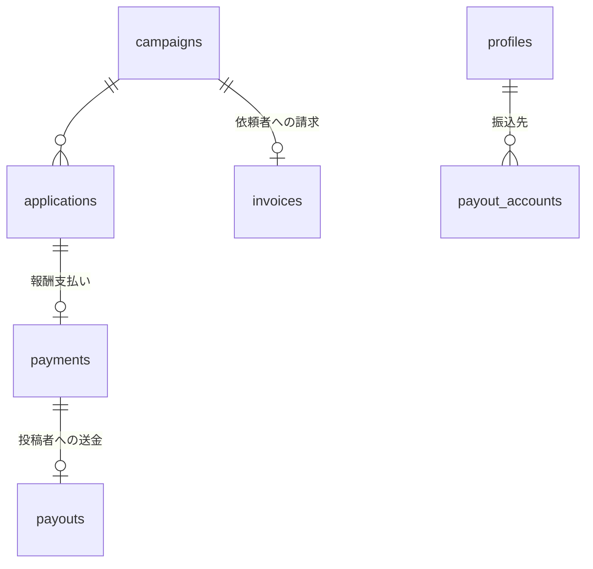

# 12. 将来拡張の設計方針

【事実】本章に記載する機能は**初期実装のスコープ外**である。ただし「後から追加できない設計にしない」ための拡張余地を、初期設計の段階で確保する。

---

## 12-1. iOS 対応

| 項目 | 方針 |
|---|---|
| 前提 | Flutter 採用により、**アプリコードの追加実装は原則不要** |
| 必要な作業 | Apple Developer Program 加入、証明書・プロビジョニング、App Store Connect 設定、審査対応 |
| 実装上の注意 | 初期実装から **iOS 固有の分岐を作らない**。プラットフォーム固有 API（位置情報・通知・OAuth のブラウザ起動）はプラグイン経由で抽象化する |
| 事前に避けるべきこと | Android 固有のディープリンク実装に依存すること。**OAuth のリダイレクトはユニバーサルリンク／App Links の両対応を前提に設計**する |
| 追加コスト | Apple Developer Program の年会費、審査対応工数 |

【推奨】初期リリース時点で iOS ビルドが**通ることだけは CI で確認**しておく（ストア申請はしない）。放置すると後で iOS 非対応のライブラリが混入していることに気づく。

---

## 12-2. 有償案件（報酬を伴う案件）

### 12-2-1. 要件の想定

【事実】依頼者の指定：**アプリ内決済／個人間やり取りのどちらも選べる**ようにする。

### 12-2-2. 拡張の設計余地（初期から確保するもの）

| # | 確保する余地 | 初期実装 |
|---|---|---|
| E-1 | `campaigns.reward_type` を持たせる | `in_kind`（無償提供）のみ。将来 `paid` / `hybrid` を追加 |
| E-2 | `campaigns.reward_value_jpy` を金額として持つ | 初期は「想定価格」として並び順に使用。有償化時は「報酬額」として再利用可能 |
| E-3 | 決済方式を案件ごとに選べるカラムの余地 | 将来 `settlement_method`（`in_app` / `direct`）を追加 |
| E-4 | 案件の状態遷移に「支払い待ち」を挿入できる構造 | `applications.status` を文字列 + CHECK 制約とし、値の追加でマイグレーションが完結する |
| E-5 | 金額を扱うテーブルを分離できる設計 | 将来 `payments` / `payouts` / `invoices` を追加。`campaigns` に金額ロジックを埋め込まない |

### 12-2-3. 将来のデータモデル（構想）

| テーブル | 想定カラム |
|---|---|
| `payments` | `application_id`, `amount`, `currency`, `method`(`in_app`/`direct`), `status`, `provider_txn_id` |
| `payouts` | `payment_id`, `payee_id`, `amount`, `fee`, `status`, `paid_at` |
| `payout_accounts` | `user_id`, 振込先情報（**要暗号化。`private` スキーマに置く**） |
| `invoices` | `client_id`, `campaign_id`, `amount`, `issued_at` |

---

## 12-3. アプリ内決済

【事実】ストアの規約により、**デジタルコンテンツか実物・実サービスかで扱いが変わる**。本アプリの報酬は「役務提供の対価」であり、一般にストア内課金の対象外（外部決済が許容される）と考えられるが、**実装前にストア規約の確認が必須**（`OI-40`）。

| 論点 | 方針 |
|---|---|
| 決済代行の選定 | Stripe 等の外部決済を想定。ストア内課金は使わない前提で設計 |
| エスクロー | 投稿完了を条件に投稿者へ送金する。**依頼者から先に預かり、完了時に払い出す**方式が妥当 |
| 資金決済法 | 資金移動業に該当しない形（決済代行の仕組みに乗る）を選ぶ。**法務確認が必須** |
| 本人確認（KYC） | 送金には本人確認が必要になる（`OI-19`） |
| インボイス制度 | 適格請求書の発行要否を確認 |
| 手数料 | 収益モデルの一部。案件金額に対する率で設計 |

【推奨】**決済は自前実装せず、決済代行サービスの仕組みに完全に乗る。** 資金を自社で保持する設計は法規制上のリスクが大きい。

---

## 12-4. 月額課金（サブスクリプション）

| 項目 | 方針 |
|---|---|
| 対象 | PR依頼者向けを想定（案件掲載数の上限解放、詳細な成果レポート、優先表示など） |
| 設計余地 | `profiles` に `plan` カラムを追加できる構造。機能ゲートは**アプリ側の分岐ではなく RLS / RPC 側**で判定する |
| 注意点 | **「有料プランならインサイト実数値が見られる」という機能は絶対に作らない。** これは本アプリの中核的な約束であり、収益と引き換えにしてはならない |
| 有料で提供してよい価値の例 | 掲載枠の増加、レポートの比較機能、条件テンプレートの保存数、優先サポート |

【事実】上記の「注意点」は本アプリの根幹に関わるため、**将来の意思決定者への申し送り事項**として明記する。

---

## 12-5. 対応 SNS の拡張

| 項目 | 方針 |
|---|---|
| 拡張しやすさの確保 | `private.social_credentials.platform` と `creator_metrics.platform` により、テーブル追加なしで新プラットフォームを追加できる |
| 指標の差異 | 条件式に `platform` を含めているため、「Instagram の保存数」と「TikTok の保存数」を別条件として扱える |
| Edge Function の構造 | プラットフォームごとの API クライアントを**インタフェースで抽象化**し、`sync-worker` からは共通の呼び出しにする |
| 未対応指標の扱い | 取得できない指標は `NULL`。条件に含まれていれば「不合致」として扱う（`OI-41`） |

---

## 12-6. その他の拡張候補

| # | 拡張 | 備考 |
|---|---|---|
| F-1 | 投稿者のランク・実績バッジ | 完了率・投稿品質に基づく。**インサイト実数値を露出しない形**で設計する必要がある（例：ランクは公開するが根拠の数値は非公開） |
| F-2 | PR依頼者からの評価・レビュー | 匿名性との両立が課題。**個人に紐づく評価は名寄せの手がかりになる** |
| F-3 | 案件のレコメンド | 投稿者の過去応募傾向から推薦 |
| F-4 | Web 版（投稿者・PR依頼者） | Flutter Web で対応可能だが、運用対象が増える |
| F-5 | 多言語対応 | |
| F-6 | 複数店舗の管理（フランチャイズ対応） | `client_profiles` を 1 ユーザー 1 店舗から多店舗へ拡張する必要がある（`OI-42`） |

【推奨】**F-1・F-2 は匿名性要件と衝突しやすい。** 実装検討時には、必ず「その情報から個人のインサイトが推測できないか」を評価すること。

---

## 12-7. 拡張時に守るべき不変条件

【事実】将来どのような機能を追加する場合でも、以下は変更しない。

| # | 不変条件 |
|---|---|
| I-1 | インサイト実数値は `private` スキーマの外に出さない |
| I-2 | PR依頼者に個人単位のインサイトを開示しない（有料プランでも例外なし） |
| I-3 | 集計値の開示は k-匿名性（k=5）を満たす場合のみ |
| I-4 | PR依頼者に見せる投稿者の識別子は案件内で閉じた連番のみ |
| I-5 | SNS アクセストークンをクライアントに渡さない |
| I-6 | SNS データの取得は本人の OAuth 認可に基づく公式 API のみ |

---

## 本章の未決事項

| ID | タイトル |
|---|---|
| `OI-19` | 本人確認（KYC）の要否 |
| `OI-40` | 有償案件におけるストア規約・決済方式の確認 |
| `OI-41` | 未対応指標が条件に含まれる場合の扱い |
| `OI-42` | 1 アカウントで複数店舗を管理する要件の有無 |

詳細は [open_issues.md](../open_issues.md) を参照。
